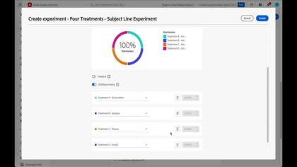

# Tutoriais do Journey Optimizer

O Journey Optimizer permite que as empresas criem experiências coesas, contextuais e personalizadas para clientes. Ele guia clientes com facilidade durante toda a jornada da marca, desde o ponto inicial de contato até o momento em que saem do site, garantindo uma experiência conectada e satisfatória em cada ponto de contato.

Este guia do usuário contém vídeos e tutoriais sobre os vários recursos e características do Adobe Journey Optimizer. Pratique o que você aprendeu participando dos [Desafios do Journey Optimizer](https://experienceleague.adobe.com/pt-br/docs/journey-optimizer-learn/challenges/introduction-and-prerequisites).

## Últimos eventos ao vivo da Experience League

<!-- CARDS
* https://experienceleague.adobe.com/en/docs/events/experience-league-live-recordings/episodes/exl-live-episode-06-18-25
  {title = Master Frequency Capping & Conflict Prioritization (June 18, 2025)}
  {description = In this session, Adobe experts Ariel Sultan and Aaron Forrest dove into new features in Adobe Journey Optimizer to help you govern and prioritize customer messages with precision. They showed how to reduce messaging fatigue, resolve conflicts, and deliver impactful experiences that resonate. }
* https://experienceleague.adobe.com/en/docs/events/experience-league-live-recordings/episodes/exl-live-episode-40-2024-10-24
     {title = Agile Workflows for Personalized Content at Scale (June 05, 2025)}
     {description = In this session, Adobe experts Chris Ivory, Amarnath Vannarath, and Rohan Bhatt showcase how Adobe Journey Optimizer (AJO) seamlessly integrates with Adobe Express and GenStudio for Performance Marketing. Learn how these tools bring unparalleled flexibility, collaboration, and AI-powered creativity to your marketing workflows.}
* https://experienceleague.adobe.com/en/docs/events/experience-league-live-recordings/episodes/exl-live-episode-02-27-25
     {title = Unlocking operational insights with AI Assistant in Adobe Experience Platform (February 27, 2025)}
     {description = ur experts discussed how AI Assistant can unlock valuable operational insights, boosting productivity and redefining work in Adobe Experience Platform and its platform-based applications.}

-->
<!-- START CARDS HTML - DO NOT MODIFY BY HAND -->

    

        

            

                <figure class="image x-is-16by9">
                    
                </figure>
            

            

                

                    

                        <a href="https://experienceleague.adobe.com/en/docs/events/experience-league-live-recordings/episodes/exl-live-episode-06-18-25" target="_blank" rel="referrer" title="Limite de frequência principal e priorização de conflitos (18 de junho de 2025)">Limite de frequência principal e Priorização de conflito (18 de junho de 2025)</a>
                    

                    
Nesta sessão, os especialistas da Adobe, Ariel Sultan e Aaron Forrest, analisam os novos recursos do Adobe Journey Optimizer para ajudar você a administrar e priorizar as mensagens dos clientes com precisão. Eles mostraram como reduzir a fadiga das mensagens, resolver conflitos e fornecer experiências impactantes que repercutem.

                

                <a href="https://experienceleague.adobe.com/en/docs/events/experience-league-live-recordings/episodes/exl-live-episode-06-18-25" target="_blank" rel="referrer" class="spectrum-Button spectrum-Button--outline spectrum-Button--primary spectrum-Button--sizeM" style="align-self: flex-start; margin-top: 1rem;">
                    Assistir
                </a>
            

        

    

    

        

            

                <figure class="image x-is-16by9">
                    
                </figure>
            

            

                

                    

                        <a href="https://experienceleague.adobe.com/en/docs/events/experience-league-live-recordings/episodes/exl-live-episode-40-2024-10-24" target="_blank" rel="referrer" title="Fluxos de trabalho ágeis para conteúdo personalizado em escala (05 de junho de 2025)">Fluxos de Trabalho Agile para Conteúdo Personalizado em Escala (05 de junho de 2025)</a>
                    

                    
Nesta sessão, os especialistas da Adobe Chris Ivory, Amarnath Vannarath e Rohan Bhatt demonstram como o Adobe Journey Optimizer (AJO) se integra perfeitamente ao Adobe Express e ao GenStudio for Performance Marketing. Saiba como essas ferramentas oferecem flexibilidade, colaboração e criatividade baseada em IA inigualáveis aos seus fluxos de trabalho de marketing.

                

                <a href="https://experienceleague.adobe.com/en/docs/events/experience-league-live-recordings/episodes/exl-live-episode-40-2024-10-24" target="_blank" rel="referrer" class="spectrum-Button spectrum-Button--outline spectrum-Button--primary spectrum-Button--sizeM" style="align-self: flex-start; margin-top: 1rem;">
                    Assistir
                </a>
            

        

    

    

        

            

                <figure class="image x-is-16by9">
                    
                </figure>
            

            

                

                    

                        <a href="https://experienceleague.adobe.com/en/docs/events/experience-league-live-recordings/episodes/exl-live-episode-02-27-25" target="_blank" rel="referrer" title="Desbloquear insights operacionais com o Assistente de IA no Adobe Experience Platform (27 de fevereiro de 2025)">Desbloqueando insights operacionais com o Assistente de IA no Adobe Experience Platform (27 de fevereiro de 2025)</a>
                    

                    
Nossos especialistas discutiram como o AI Assistant pode desbloquear insights operacionais valiosos, aumentando a produtividade e redefinindo o trabalho no Adobe Experience Platform e em seus aplicativos baseados em plataforma.

                

                <a href="https://experienceleague.adobe.com/en/docs/events/experience-league-live-recordings/episodes/exl-live-episode-02-27-25" target="_blank" rel="referrer" class="spectrum-Button spectrum-Button--outline spectrum-Button--primary spectrum-Button--sizeM" style="align-self: flex-start; margin-top: 1rem;">
                    Assistir
                </a>
            

        

    

<!-- END CARDS HTML - DO NOT MODIFY BY HAND -->

## Escolhas de pessoal

<table>
<tr>
    <td>
    
    

      <a href="../content-management/create-content-using-ai-assistant-for-content-generation.md">
    <strong>Criar conteúdo com a geração de conteúdo do Assistente de IA</strong>
    </a>
    

    

    <em>Saiba como usar a geração de conteúdo do Assistente de IA para gerar sugestões proativas de variação de conteúdo para textos e imagens.
</em>
    

  </td>
    <td>
    
    

      <a href="../experimentation/content-experiments-for-emails.md">
    <strong>Configurar experimentos de conteúdo para campanhas de email </strong>
    </a>
    

    

    <em>Saiba como configurar experimentos de conteúdo para testes A/B e explorar o conteúdo de email que melhor impulsiona seus objetivos de negócios.</em>
    

  </td>
  </td>
    <td>
    
    

      <a href="../decision-management/create-decisions.md">
    <strong>Introdução aos recursos de gestão de decisões </strong>
    </a>
    

    

    <em>O vídeo aborda os desafios comerciais que os recursos de gestão de decisões solucionam, as funcionalidades mais importantes, a arquitetura básica e os principais casos de uso.

</em>
    

  </td>
</tr>
<tr>
  <td>
    
    

      <a href="../create-journeys/use-case-transactional-journey.md">
    <strong>Caso de uso - Jornada transacional </strong>
    </a>
    

    

    <em>Entenda os casos de uso aplicáveis a jornadas transacionais. Saiba como criar jornadas transacionais e quais práticas recomendadas devem ser aplicadas.</em>
    

  </td>
    <td>
    
    

      <a href="../personalize-content/use-contextual-event-information-for-personalization.md">
    <strong>Usar informações de evento contextual para personalização </strong>
    </a>
    

    

    <em>Saiba como usar informações de evento contextual de uma jornada para personalizar uma mensagem.</em>
    

  </td>
  </td>
    <td>
    
    

      <a href="../report-and-monitor/live-and-global-reports.md">
    <strong>Relatórios dinâmicos e globais </strong>
    </a>
    

    

    <em>Saiba mais sobre a diferença entre relatórios dinâmicos e globais, como acessar e analisar a jornada e os relatórios específicos de mensagem e como modificar os painéis do relatório.

</em>
    

  </td>
</tr>
</table>

