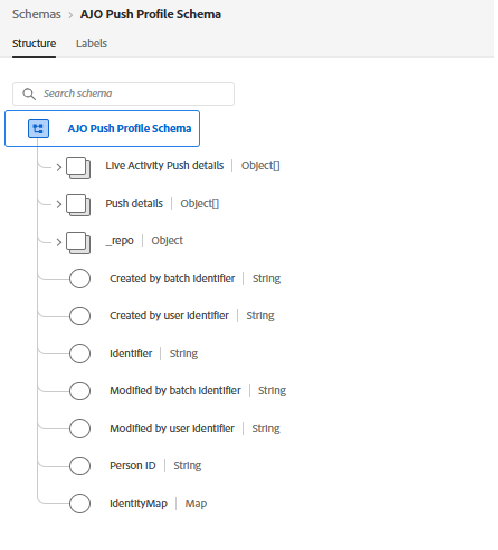
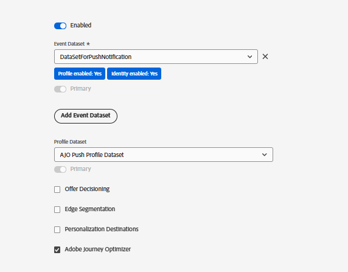

# Criar sequência de dados

Uma sequência de dados no Adobe Experience Platform (AEP) atua como o endpoint que recebe dados enviados do Web SDK. Ele roteia esses dados para serviços configurados, como AEP, Adobe Analytics ou Adobe Journey Optimizer. Neste tutorial, a sequência de dados é usada para enviar dados de assinatura push da Web e eventos price.drop para ativação no AEP.

## Criar esquema de evento para rastrear notificações por push

Crie um novo esquema XDM ExperienceEvent chamado `SchemaForPushNotification`. Adicionar os grupos de campos `Push Notification Tracking` e `Commerce Details` a este esquema. Os campos do grupo de campos Detalhes do Commerce serão usados para capturar informações do produto e acionar o evento price.drop personalizado.

## Criar esquema de perfil para salvar o consentimento do usuário

Para este tutorial, usamos o `AJO Push Profile Schema` pronto para uso. Este esquema armazena os detalhes da assinatura push do usuário, incluindo o token push necessário para fornecer notificações por push na Web.

## Criar conjuntos de dados para o esquema

Crie um conjunto de dados chamado `DataSetForPushNotification` usando o esquema de evento criado anteriormente. Para dados de perfil, use o `AJO Push Profile Dataset` pronto para uso, que está associado ao esquema de perfil de push. Anote a ID `DataSetForPushNotification`, que será necessária posteriormente no tutorial ao configurar o aplicativo por meio do arquivo .env.

## Criar sequência de dados usando o evento e o conjunto de dados do perfil

Crie um novo fluxo de dados chamado WebPushDataStream usando os conjuntos de dados de evento e perfil criados na etapa anterior. Anote a ID de sequência de dados, pois ela será necessária posteriormente no tutorial ao configurar o aplicativo por meio do arquivo .env.

