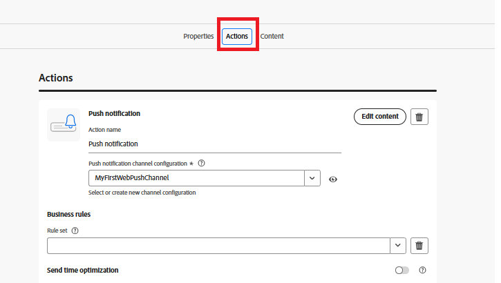

# Criar Jornada

Nesta etapa, você criará uma jornada no Adobe Journey Optimizer acionada pelo evento price.drop personalizado. Quando esse evento é recebido, a jornada é iniciada em tempo real e envia uma notificação por push aos usuários que aceitaram, permitindo o engajamento orientado por eventos.

Para criar uma jornada acionada no evento price.drop, siga as seguintes etapas

* Fazer logon no Journey Optimizer
* Navegue até Gerenciamento de Jornadas | Jornadas | Criar Jornada

## Adicionar PriceDropEvent

Arraste o `PriceDropEvent` da seção de eventos para a tela

## Adicionar ação de push

Expanda a seção Ações. Arraste e solte a atividade `Action` na tela e selecione Enviar como o tipo de ação

## Configurar a ação de push

Selecione a atividade de notificação por push e clique na ação de configuração

## Configuração do canal de notificações por push

Associar a configuração `MyFirstWebPushChannel` criada anteriormente no tutorial com esta notificação por push

## Compor mensagem de notificação por push

Adicione uma combinação de conteúdo estático e dinâmico à notificação por push usando o editor de personalização para tornar a mensagem mais envolvente e relevante.

Para começar a compor a mensagem, clique em `Content` para abrir a guia de conteúdo, onde é possível definir o texto fixo e os campos dinâmicos derivados dos dados do evento.

Especifique o título da mensagem de push e abra o editor de personalização para compor o corpo da mensagem. O conteúdo incluirá dinamicamente os nomes dos produtos cujos preços caíram. Para fazer isso, use cada [função auxiliar](https://experienceleague.adobe.com/en/docs/journey-optimizer/using/content-management/personalization/functions/helpers#each)
para iterar sobre a lista de produtos e renderizar seus nomes na mensagem.

## Compor o corpo da mensagem

Selecione e insira a função `Each` no menu de funções auxiliares.

Selecione os atributos contextuais | Journey Orchestration | Events | PriceDropEvent | productListItems | Name

Clique no ícone &quot;+&quot; para inserir a matriz em cada loop no editor de personalização. Em seguida, atualize o conteúdo da mensagem para corresponder ao formato mostrado na captura de tela de referência. Observe que a ID de evento exibida em seu ambiente pode ser diferente da mostrada.

Por fim, salve todas as alterações e publique a jornada. Depois de publicada, a jornada fica ativa e acompanha os eventos price.drop recebidos. Sempre que esse evento é recebido, a jornada é acionada em tempo real e uma notificação por push é enviada aos usuários que optaram por receber notificações, garantindo um engajamento oportuno e relevante.

## Testar a solução

Para acionar o evento price.drop, abra a [página do acionador de queda de preço](http://localhost:3000/price-drop-trigger.html), selecione um ou mais produtos e clique em Acionar Queda de Preço. Isso envia o evento por meio da Camada de dados do Adobe usando Tags da AEP, que, em seguida, inicia a jornada e fornece a notificação por push em tempo real.

