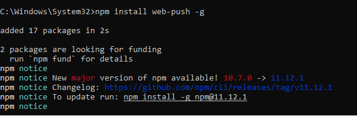

# Criar canal de push

A primeira etapa é criar um Canal por push no Adobe Journey Optimizer. Como parte dessa configuração, você precisará gerar chaves VAPID, que são necessárias para autenticar e habilitar as notificações por push da Web. Essas chaves são usadas na configuração do canal de push, permitindo que o AJO envie notificações com segurança para os usuários inscritos.

## Gerar chaves VAPID

VAPID (Voluntary Application Server Identification, Identificação voluntária do servidor de aplicações) é um padrão de push da Web que permite que o servidor se identifique para enviar serviços (como Chrome, Edge etc.) usando pares de chaves públicas/privadas, para que o provedor de push saiba quem está enviando a notificação.

Ele é gerado usando uma ferramenta como web-push generate-vapid-keys, que cria uma chave pública (compartilhada com o navegador) e uma chave privada (mantida em seu servidor) usadas juntas para autenticar e enviar mensagens de push com segurança.

Para este tutorial, usamos Node.js para gerar as chaves VAPID.

Verifique se o Node.js está instalado. Em seguida, execute o seguinte comando
```npm install web-push -g ```



```web-push generate-vapid-keys```


## Criar credencial de push

* Fazer logon no Journey Optimizer

* Navegue até Administração | Canais | CONFIGURAÇÕES DE PUSH | Credenciais de push | Criar credencial de push

* 

## Criar configuração de canal

* Fazer logon no Journey Optimizer

* Navegue até Administração | Canais | Criar configuração de canal
  
