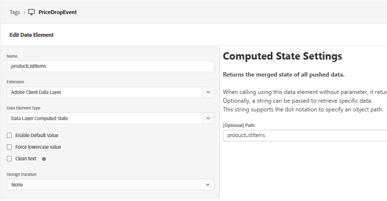

# Criar propriedade de tag

Na segunda parte deste tutorial, você aprenderá a acionar notificações por push em tempo real, enviando manualmente um evento price.drop personalizado. Essa abordagem usa a Coleção de dados (tags) da AEP para capturar o evento da página da Web e enviá-lo para a Adobe Experience Platform. Depois que o evento é assimilado, ele aciona uma jornada no Adobe Journey Optimizer, permitindo enviar notificações por push sob demanda com base nas ações do usuário ou eventos comerciais.

Essa propriedade é configurada com o AEP Web SDK, que está conectado ao `WebPushDataStream` criado anteriormente no tutorial. A propriedade da marca escuta o evento `price.drop` na Camada de Dados do Adobe e mapeia os detalhes relevantes do produto atualizando o elemento de dados ProductListItems. Depois que os dados são preparados, uma regra na propriedade da tag é acionada e envia o evento price.drop para a AEP por meio da Web SDK. Esse evento serve como ponto de entrada para uma jornada no Adobe Journey Optimizer, permitindo a entrega imediata de notificações por push com base na queda de preço.

## Elementos de tag

ProductListItems para conter detalhes do produto



mapeamento de xdmvariable para o `schemaForPushNotification`


## Criar regra

Ouça o evento price.drop


Atualizar productListItems usando a variável de atualização

Por fim, envie o evento price.drop para o AEP com a variável xd atualizada


O código javascript a seguir envia o evento price.drop para as Tags do AEP da página da Web

```javascript
 <script>
      window.adobeDataLayer.push({
        event: "price.drop",
        productListItems: productListItems
      });
  </script>
```


