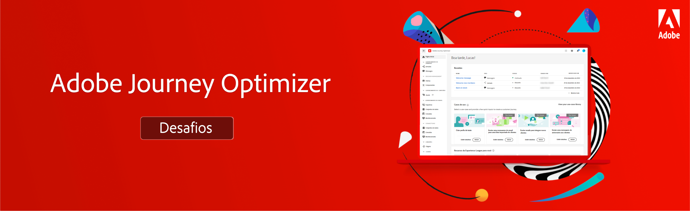

# Desafios do Journey Optimizer - Introdução e pré-requisitos

Os desafios proporcionam um cenário e os requisitos necessários para praticar o que você aprendeu. Os desafios ajudam a avaliar seu nível de habilidade e identificar lacunas de conhecimento.

Cada desafio desta seção aborda um caso de uso exclusivo que você implementa. O público-alvo (persona) e as habilidades necessárias são listados no início de cada desafio.

## Pré-requisitos

### Requisitos do sistema

* Acesso a uma sandbox do Journey Optimizer - recomendamos concluir o desafio em uma sandbox de treinamento dedicada.
* O AEM Assets Essentials deve ser provisionado para sua instância
* O canal de email deve ser configurado para mensagens transacionais e de marketing

### Direitos de acesso

Você precisa dos seguintes direitos de acesso:
* *Gerenciador de Jornada* ou *Administrador de Jornada*
* Exibir perfis de teste e seus atributos

>[!NOTE]
> Os exercícios foram desenvolvidos com base nos dados da amostra do Luma. É recomendável configurar uma sandbox de treinamento configurada com os dados de amostra. Visite o tutorial [Configurar uma sandbox de treinamento](/help/tutorial-configure-a-training-sandbox/introduction-and-prerequisites.md) para obter instruções detalhadas.

### Ações necessárias

* Se você é novo no Adobe Journey Optimizer, conplete o curso [Introdução ao Journey Optimizer para Administradores e Gerentes de Jornada](https://experienceleague.adobe.com/?recommended=JourneyOptimizer-U-1-2021.1).

## A História

Luma é uma empresa ficcional de vestuário esportivo, com lojas em vários países, tem presença online com um site e aplicativos para dispositivos móveis. A Luma usa o Adobe Journey Optimizer para fornecer experiências conectadas, contextuais e personalizadas aos seus clientes.

A Luma pretende promover sua coleção de roupas e equipamentos mais recentes e impulsionar as vendas dos clientes existentes. Você foi contratado para implementar as campanhas de marketing e retenção da Luma no Journey Optimizer.

## Seus desafios

<table>
<tr>
<td>
 

      
      

  </td>
  <td>
   <strong><a href="summer-collection-announcement-challenge.md">Criar um anúncio de coleção de verão </strong>
 </a>
      

      <em>Crie uma jornada que envia um email de anúncio da coleção de verão para um segmento de clientes existentes. </em>
      

      <b>Competências necessárias:</b>
      <li><a href="https://experienceleague.adobe.com/docs/journey-optimizer-learn/tutorials/profiles-segments-subscriptions/create-segments.html?lang=pt-BR"> Criar segmentos</li>
      <li><a href="https://experienceleague.adobe.com/docs/journey-optimizer-learn/tutorials/create-journeys/use-case-read-segment.html?lang=pt-BR">Ler segmento</li>
       <li><a href="https://experienceleague.adobe.com/docs/journey-optimizer-learn/tutorials/create-messages/create-emails/import-and-author-html-email-content.html?lang=pt-BR">Importar conteúdo HTML do email</li>
  </td>
  </tr>
   <tr>
    <td>
    

    
    

    <td>
    

      <a>
 <strong><a href="loyalty-status-welcome-email-challenge.md">Criar um email de boas-vindas do status de fidelidade </strong>
 </a>
    

    

    <em>Envie um email quando um cliente de fidelidade mudar para um novo nível para parabenizá-lo e informar a ele sobre seus novos benefícios.</em>
    

    <b>Competências necessárias:</b>
      <li><a href="https://experienceleague.adobe.com/docs/journey-optimizer-learn/tutorials/profiles-segments-subscriptions/create-segments.html?lang=pt-BR"> Criar segmentos</li>
      <li><a href="https://experienceleague.adobe.com/docs/journey-optimizer-learn/tutorials/create-journeys/use-case-read-segment-qualification.html?lang=pt-BR">Qualificação do segmento</li>
      <li><a href="https://experienceleague.adobe.com/docs/journey-optimizer-learn/tutorials/create-messages/create-emails/import-and-author-html-email-content.html?lang=pt-BR">Importar e criar conteúdo de email HTML</li>
  </td>
  </tr>
  <tr>
  <td>
  

    
  </td>
  <td>
      <a href="order-confirmation-challenge.md">
 <strong><a href="order-confirmation-challenge.md">Criar uma confirmação do pedido</strong>
 </a>
    

    

    <em>Teste seu conhecimento sobre como criar e personalizar mensagens transacionais
 </em>
    

    <b>Competências necessárias:</b>
      <li><a href="https://experienceleague.adobe.com/docs/journey-optimizer-learn/tutorials/create-messages/create-content-with-the-email-designer.html?lang=pt-BR"> Criar conteúdo de email com o editor de mensagens</li>
      <li><a href="https://experienceleague.adobe.com/docs/journey-optimizer-learn/tutorials/personalize-content/use-contextual-event-information-for-personalization.html?lang=pt-BR">Usar informações de evento contextual para personalização</li>
      <li><a href="https://experienceleague.adobe.com/docs/journey-optimizer-learn/tutorials/personalize-content/use-helper-functions-for-personalization.html?lang=pt-br">Usar funções auxiliares para personalização</li>
  </td>
</table>
