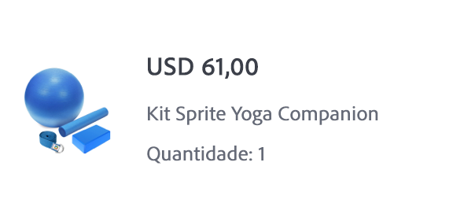
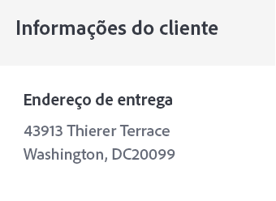

# Criar um email de confirmação de pedido


| Desafio | Criar um email transacional de confirmação de pedido |
|---|---|
| Perfil | Gerenciador de jornadas |
| Competências necessárias | <ul><li>[Criar conteúdo de email com o editor de mensagens](https://experienceleague.adobe.com/docs/journey-optimizer-learn/tutorials/create-messages/create-email-content-with-the-message-editor.html?lang=en)</li> <li>[Usar informações de evento contextual para personalização](https://experienceleague.adobe.com/docs/journey-optimizer-learn/tutorials/personalize-content/use-contextual-event-information-for-personalization.html?lang=en)</li><li>[Usar funções auxiliares para personalização](https://experienceleague.adobe.com/docs/journey-optimizer-learn/tutorials/personalize-content/use-helper-functions-for-personalization.html?lang=en)</li></ul> |
| Ativos para baixar | [Ativos de confirmação de pedido](/help/challenges/assets/email-assets/order-confirmation-assets.zip) |

## A História

A Luma está lançando sua loja online e deseja garantir uma boa experiência do cliente ao fornecer um email de confirmação de pedido depois que o cliente fizer um pedido.


## Seu desafio

Crie uma jornada que envia um email de confirmação de pedido quando um cliente Luma conclui um pedido online. O Luma

>[!BEGINTABS]

>[!TAB Tarefa]

1. Crie uma jornada chamada `Luma - Order Confirmation`
2. Use o evento : `LumaOnlinePurchase` como um acionador
3. Crie o email de confirmação do pedido chamado `Luma - Order Confirmation`:

* Transacional de categoria - selecione a superfície de email transacional
* A linha de assunto deve ser personalizada com o nome dos recipients e deve incluir a frase &quot;obrigado pela sua compra&quot;
* Use o `Luma - Order summary` e modificá-lo:

O email deve ser estruturado da seguinte maneira:
<table>
<tr>
<td>
  <div>
     <strong> Seção do cabeçalho</strong>
      </div>
  </td>
  <td>
    <strong>Logotipo Luma</strong>
      <p>
     <li>luma_logo.png</li>
    <li>Ele deve ter um link para o site do luma: https://publish1034.adobedemo.com/content/luma/us/en.html</li>
    <p>
    </td>
  </tr>
  <tr>
  <td>
  <div>
    <strong>Seção de Confirmação de Pedido
    </strong>
  </td>
  <td>
    <p>
    <strong>Texto</strong><p>
    <em>Ei {nome}</em><p>
    <li>Alinhamento: left  </li>
   <li>Cor do texto: rgb(69, 97, 162) #4461a2; 
   <li>tamanho da fonte: 20px</li>
   <div>
    <p>
     <em>Seu pedido foi feito.
    <p>Quando o pacote for enviado, enviaremos um email com um número de rastreamento para que você possa rastrear seu pedido.</p></em>
    </strong>
    </tr>
  </td>
 <td>
  <div>
     <strong> Seção Entregar para</strong>
      </div>
      <p><li>Substitua o endereço codificado no modelo pelo endereço de envio 
      <li>Os detalhes do endereço são atributos contextuais do evento (rua, cidade, código postal, estado)
      <li>O nome e o sobrenome são do perfil
      <li> Remover o Desconto, Total, Chegando</p>
  </td>
  <td>
  <p> Enviar para:</p>
      <em>Sobrenome do nome<br>
     Endereço</em></p>
  </td>
 <tr>
<td>
  <div>
     <strong>Seção Detalhes do Pedido</strong>
      </div>
       <p><li>Adicione esta seção após a <b>Entregar para</b> e a <b>Exibir pedido</b> botão.
      </p><br>
      <p><b>Dicas:</b>
      <li>Essas são informações de evento contextual.
      <li>Use a função auxiliar [!UICONTROL]: [!UICONTROL Cada]
      <li>Alterne para o formato do editor de códigos para adicionar os dados contextuais.
      <li>Coloque as informações em contêineres usando tags DIV.
  </td>
  <td>
    <strong>Header</strong>
    <p>
    <em>Pedido: "purchaseOrderNumber"</em>
    </p>
    <strong>Lista de produtos encomendados:
  </strong>
  <p>Cada um dos itens deve ser formatado desta forma:
    
</p>
<strong>Imagem do produto:</strong>
<li>classe: cadeira de itens do carrinho
<li>estilo: caixa de borda: altura mínima:40px</li>
<li>preenchimento superior e inferior:20px</li>
<li>preenchimento à esquerda:80px</li>
<li>border-radius:0px</li>
<li>Usar como imagem de plano de fundo para o contêiner</li>
<li>posição de fundo: 0% 50%</li>
<li>tamanho do plano de fundo: 60px</li>
<li>repetição em segundo plano: sem repetição</li>
<p>
<strong>Preço:</strong>
<li>Formato = H5</li>
<li>estilo = dimensionamento de caixa:caixa de borda</li>
<li>margem inferior:5 px</li>
<li>margem superior:0px;</li>
<p>
<strong>Nome e quantidade:</strong>
<li>class=text-small</li>
<li>style=box-sizing: border-box</li>
<li>tampa do preenchimento: 5px</li>
<li>cor: rgb(101, 106, 119)</li>
<li>tamanho da fonte:14px</li>
<p>
</td>
  </tr>
</table>


>[!TIP]
>
>Para permitir que você solucione problemas em suas jornadas, a prática recomendada é adicionar um caminho alternativo a todas as ações de mensagem em caso de tempo limite ou erro.

>[!TAB Critérios de sucesso]

Acione a Jornada criada no modo de teste e envie o email para você mesmo:

1. Mostre os valores ocultos clicando no símbolo dos olhos:
   1. Nos Parâmetros de email, clique no símbolo T (ativar substituição de parâmetro)
      
   2. Clique no campo Endereço
   3. Na próxima tela, adicione o endereço de email entre parênteses: *yourname@yourdomain* no editor de expressão e clique em ok.
2. Coloque a jornada no modo de teste
3. Acione o evento com os seguintes parâmetros:
   * Defina o identificador do perfil para: Valor de identidade:`a8f14eab3b483c2b96171b575ecd90b1`
   * Tipo de evento: commerce.purches
   * Nome: Sprite Yoga Companion Kit
   * Quantidade: 1
   * `Price Total:` 61
   * `Purchase Order Number:` 6253728
   * `SKU:` 24-WG080
   * `productImageURL:` <https://publish1034.adobedemo.com/content/dam/luma/en/products/gear/fitness-equipment/luma-yoga-kit-2.jpg>
   * `City:` San Jose
   * `Postal Code:` 95110
   * `State`: CA
   * `Street:` 345 Park Ave

Você deve receber o email de confirmação de compra personalizado, com o produto especificado.

* A linha de assunto deve ter o nome do perfil de teste: Leora
* A seção de detalhes do pedido deve ser preenchida com os detalhes do pedido inseridos durante o teste

>[!TAB Verificar o seu trabalho]

**Jornada**


**Email**

**Linha de assunto:**

{{ profile.person.name.firstName }}, obrigado pela sua compra!

**Seção Enviar para:**

Esta é a aparência do código:

```javascript
{{ profile.person.name.firstName }} {{ profile.person.name.lastName }}
{{context.journey.events.454181416.commerce.shipping.address.street1}}
{{context.journey.events.454181416.commerce.shipping.address.city}}, {{context.journey.events.454181416.commerce.shipping.address.state}} {{context.journey.events.454181416.commerce.shipping.address.postalCode}}
```

*event.45481416* será um número diferente para você.

DICA: Personalizar cada linha separadamente

**Seção de detalhes da ordem:**


Esta é a aparência do código:

Header:

```javascript
Order: {{context.journey.events.1627840522.commerce.order.purchaseOrderNumber}}
```

**Lista de produtos:**

Use a função auxiliar &quot;each&quot; para criar a lista de produtos. Exiba-as em uma tabela. Esta é a aparência do código:

```javascript
<div class="text-container" contenteditable="true">
  <p><span class="acr-expression-field" contenteditable="false">{{#each context.journey.events.454181416.productListItems as |product|}}
    </span></p>
  <div class="cart-item-chair" style="box-sizing:border-box;min-height:40px;padding-top:20px;padding-bottom:20px;padding-left:80px;border-radius:0px;background-image:url({{product.VYG__902489191a0a40e67f51f17f3ea9e2dfaf2dea3bd0bebe8b._techmarketingdemos.product.imageUrl}});background-position:0% 50%;background-size:60px;background-repeat:no-repeat;">
    <h5 style="box-sizing:border-box;margin-bottom:5px;font-size:16px;line-height:20px;margin-top:0px;">${{product.VYG__902489191a0a40e67f51f17f3ea9e2dfaf2dea3bd0bebe8b._techmarketingdemos.product.price}}.00</h5>
    <div class="text-small" style="box-sizing:border-box;padding-top:5px;color:rgb(101, 106, 119);font-size:14px;">{{product.VYG__902489191a0a40e67f51f17f3ea9e2dfaf2dea3bd0bebe8b._techmarketingdemos.product.name}}</div>
    <div class="text-small" style="box-sizing:border-box;padding-top:5px;color:rgb(101, 106, 119);font-size:14px;">Quantity: {{product.quantity}}</div>
  </div>
  <div class="divider-small" style="box-sizing:border-box;height:1px;margin-top:10px;margin-bottom:10px;background-color:rgb(209, 213, 223);"> </div>
  {{/each}}<p></p>
  <p></p>
</div>
```

**Preço total:**

Total:`${{context.journey.events.1627840522.commerce.order.priceTotal}}`

**Seção de informações do cliente**



A personalização deve ter esta aparência:

```javascript
{{profile.homeAddress.street1}}
{{profile.homeAddress.city}},{{profile.homeAddress.state}} {{profile.homeAddress.postalCode}}
```

>[!ENDTABS]