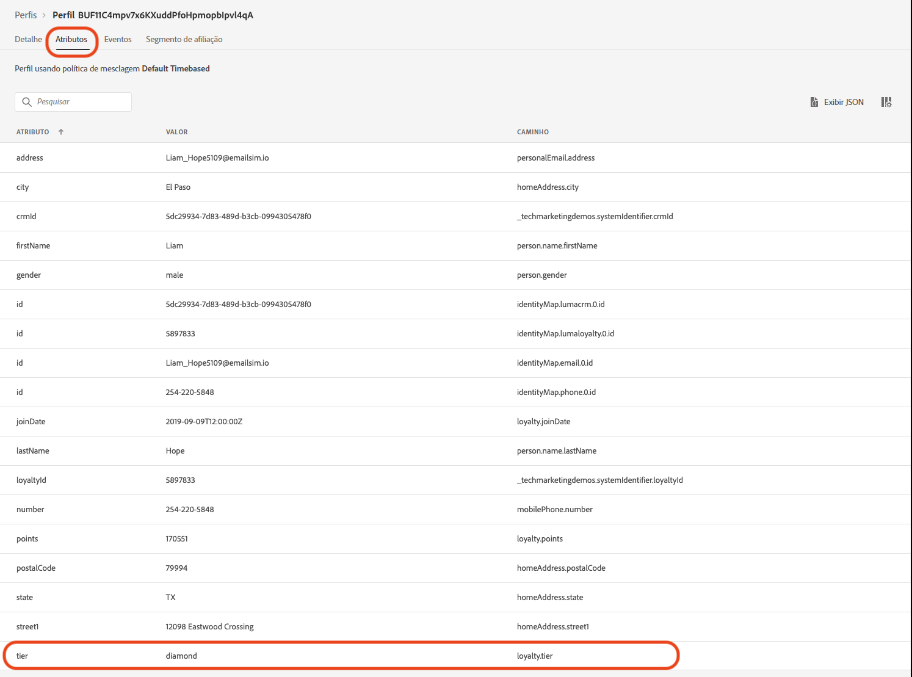
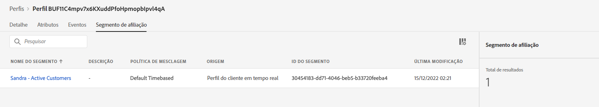

# Criar um anúncio para a Coleção de verão - Desafio

| Desafio | Criar um anúncio de Coleção de Verão |
|---|---|
| Perfil | Gerenciador de Jornadas |
| Competências necessárias | <ul><li>[Criar segmentos](https://experienceleague.adobe.com/docs/journey-optimizer-learn/tutorials/profiles-segments-subscriptions/create-segments.html?lang=pt-BR)</li><li> [Importar e criar conteúdo de email HTML](https://experienceleague.adobe.com/docs/journey-optimizer-learn/tutorials/create-messages/create-emails/import-and-author-html-email-content.html?lang=br-PT)</li><li>[Caso de uso - Ler segmento](https://experienceleague.adobe.com/docs/journey-optimizer-learn/tutorials/create-journeys/use-case-read-segment.html?lang=br-PT)</li> |
| Ativos para baixar | [Arquivos de email de Coleções sazonais](/help/challenges/assets/email-assets/emails-seasonal-collection-announcement.zip) |

{style="table-layout:auto"}

## A história

A Luma, uma empresa ficcional de vestuário atlético, está promovendo sua mais recente coleção de roupas e equipamentos para impulsionar as vendas entre clientes existentes. A Luma está lançando a nova coleção de verão e gostaria de atingir especificamente diferentes públicos-alvo.

## Seu desafio

A equipe de marketing da Luma solicita a implementação de uma campanha de marketing da Coleção de Verão no Journey Optimizer. Seu desafio é:

* Crie um público-alvo definindo quais perfis se qualificam para receber a promoção.
* Crie a jornada.

### Etapa 1: Defina o público-alvo - Clientes ativos

>[!BEGINTABS]

>[!TAB Tarefa]

#### Criar um público-alvo no [!DNL Journey Optimizer]

* Criar um público-alvo no [!DNL Journey Optimizer] chamado *Clientes ativos*.
* O segmento deve incluir somente clientes Luma ativos.
* Os clientes ativos são definidos como clientes que têm um nível no programa de fidelidade do Luma (bronze, prata, ouro ou platina).


>[!TAB Critérios de sucesso]

No construtor de segmentos, é possível ver o número estimado de perfis qualificados. Se estiver trabalhando com os dados de treinamento da sandbox, você terá cerca de 753 perfis qualificados de um total de 1,29 mil.

>[!NOTE]
>Pode levar até 24 horas para que o segmento de afiliação apareça para perfis existentes, pois os perfis existentes precisam ser preenchidos retroativamente.

**Um perfil qualificado foi adicionado ao segmento:**

Você pode verificar os perfis que foram adicionados à qualificação de segmento navegando até um dos perfis listados na sua visualização de detalhes do segmento.

Na página do perfil, verifique a guia [!UICONTROL Atributos] para confirmar que eles se qualifiquem: o nível deve ser prata, ouro, platina ou diamante.



Você também pode verificar a guia [!UICONTROL Segmento de afiliação]: seu segmento deve estar listado.



>[!TAB Verificar o seu trabalho]

Campos de segmentos: **[!UICONTROL Atributos]** > **[!UICONTROL Perfil individual XDM]** > **[!UICONTROL Fidelidade]** > **[!UICONTROL Nível]**

Esta é a aparência do seu segmento:


O código deve ter esta aparência:

```javascript
stringCompare("equals", loyalty.tier, ["diamond", "gold", "platinum", "silver"], false)
```

>[!ENDTABS]


### Etapa 2: Criação da Jornada - anúncio da Coleção de Verão

>[!BEGINTABS]

>[!TAB Tarefa]

#### Envie o anúncio da Coleção de Verão

Uma agência forneceu quatro arquivos HTML com o design para os emails:

* `SeasonalCollectionEmail.html`
* Email Coleção masculina da Luma
* Email Coleção feminina da Luma
* Email Luma - Coleção com 20% de desconto

1. [Baixe os arquivos de email da coleção da estação](/help/challenges/assets/email-assets/emails-seasonal-collection-announcement.zip).

1. Crie uma jornada chamada *Luma - Anúncio da Coleção de Verão* com base nas seguintes orientações:

   1. Envie o email *Luma - Novo anúncio da Coleção de Verão* para o segmento *Clientes ativos*, mantendo 10% do público-alvo como um grupo de controle
      * Título da mensagem *Luma - Anúncio da Coleção de Verão*
      * Linha de assunto *(nome do receipient), chegou a nova coleção de verão da Luma!*
      * Use o arquivo HTML fornecido `SeasonalCollectionEmail.html` no corpo do email.
   1. Aguarde dois dias e envie uma mensagem de email de acompanhamento com conteúdo mais direcionado:
      * Os clientes do sexo masculino devem receber o email **Coleção masculina da Luma**.
         * Título da mensagem: *Coleção masculina da Luma*
         * Linha de assunto: *(nome do destinatário), descubra os novos equipamentos atléticos masculinos!*
         * Corpo do email: `MensCollectionEmail.html` no corpo do email.
      * As clientes do sexo feminino devem receber o email **Coleção feminina da Luma**.
         * Título da mensagem: *Coleção feminina da Luma*
         * Linha de assunto: *(nome do destinatário), descubra coleção feminina da Luma!*
         * Corpo do email: `WomensCollectionEmail.html`
      * Outros clientes devem receber o email **Luma - Coleção com 20% de desconto**.
      * Título da mensagem: *Luma - Coleção com 20% de desconto*
      * Linha de assunto: *(nome do destinatário), aproveite a liquidação com 20% de desconto!*
      * Corpo do email: `20OOffCollectionEmail.html`
   1. Depois de enviar os emails direcionados acima, aguarde mais dois dias para que eles sejam abertos
   1. Se o email direcionado não for aberto em 2 dias, envie o email **Luma - Coleção com 20% de desconto** como uma tentativa final de redirecionamento


>[!TAB Critérios de sucesso]

#### Pré-visualizar os emails

**Mensagem de email nº 1 - Luma - Anúncio da coleção de verão**

Pré-visualizar o email:

1. Adicione um perfil de teste: Louise Petti:
   * Namespace de identidade: *A ID no CRM da Luma*
   * Valor de identidade: *d1f132f9f9502bba047a6ec86c4b61f9*

Resultado:

* A linha de assunto deve ficar: Louise, chegou a nova coleção da Luma!

**Mensagem de email nº 2 - Coleção masculina da Luma**

Envie uma prova para si mesmo:

1. Adicione um perfil de teste: Stanleigh Stooke:
   * Namespace de identidade: *A ID no CRM da Luma*
   * Valor de identidade: `4f34057d9d9e792c28ba18ecae378e98`
2. Selecione o perfil de teste: Stanleigh Stooke.
3. Envie uma prova para si mesmo.

Resultado:\
Você deve receber um email. A linha de assunto deve ficar *&quot;Stanleigh, descubra os novos equipamentos atléticos masculinos!&quot;* e o corpo do email devem corresponder aos valores exibidos na visualização.

>[!NOTE]
>Pode levar alguns minutos para você receber a prova.

**Mensagem de email nº 3 - Coleção feminina da Luma**

Pré-visualize o email com o perfil de teste *Louise Petti.*

* A linha de assunto deve ficar: *Louise, descubra coleção feminina da Luma!*

**Mensagem de email nº 4 - Luma - Coleção com 20% de desconto**

Visualizar o email com o perfil de teste *Louise Petti.*

* A linha de assunto deve ser: *Louise, aproveite a liquidação com 20% de desconto!*

#### Teste a jornada

>[!IMPORTANT]
>
>Antes de definir a jornada no modo de teste:
>
>1. Certifique-se de que a [!UICONTROL Atividade Ler segmento] tem o namespace definido como **ID do CRM da Luma (lumaCrmId)**
>1. Para cada email, substitua os parâmetros de email padrão nos emails de modo que eles sejam enviados para seu endereço de email:
>    * Exiba os valores ocultos clicando no ícone de olho.
>    * Nos parâmetros de email, clique no ícone de T (habilitar a substituição de parâmetro).
>
>      
> 
>    * Clique no campo [!UICONTROL Endereço]
>    * Na próxima tela, adicione seu endereço de email entre parênteses: `"yourname@yourdomain"` no editor de expressão e clique em OK.
>

Teste a jornada e envie os emails para sua própria conta:

1. Coloque a jornada no modo de teste.
1. Selecione **[!UICONTROL Um perfil por vez]**.
1. Tempo de espera: Defina o cronômetro como 120 segundos (insira o valor no campo).
1. Acione a entrada do perfil
1. Você pode testar cada ramificação usando uma das seguintes *IDs do CRM da Luma* como identificadores de perfil:
   * Feminino: Leora Dietsche, valor de identidade:`a8f14eab3b483c2b96171b575ecd90b1`
   * Masculino: Stanleigh Stooke, valor de identidade: `4f34057d9d9e792c28ba18ecae378e98`
   * Gênero não especificado: Louise Petti, valor de identidade: `d1f132f9f9502bba047a6ec86c4b61f9`

1. Depois de acionar a entrada do perfil, você deve receber o primeiro email. O cabeçalho deve ser personalizado de acordo com o perfil escolhido.
1. A jornada deve continuar na respectiva ramificação e você deve receber o email relacionado (por exemplo, se escolher *Jenna*, deverá receber o email *Coleção Luma para mulheres*).
1. Abra o segundo email e a jornada deve terminar.
1. Você pode repetir as etapas 4 a 7 em todos os três perfis para verificar se suas ramificações estão funcionando corretamente.
1. Para testar o tempo limite, defina o tempo de espera como 30 segundos e acione a entrada novamente.
1. Não abra os emails recebidos (não visualize o email (!)) e deixe o tempo de espera passar.

Você deve receber os seguintes emails:

* Luma - Anúncio da nova coleção da estação
* Dependendo do perfil de teste usado, você deve receber um dos seguintes emails:
   * Leora: Coleção Luma para mulheres
   * Stanleigh: Coleção Luma para homens
   * Louise: Luma - Coleção com 20% de desconto
* Caso não tenha aberto o segundo email: Luma - Coleção com 20% de desconto

>[!TAB Verifique o seu trabalho]

Esta deve ser a aparência da sua jornada:


**Condição - Grupo de controle:**


**Condição - Gênero:**\


>[!ENDTABS]
