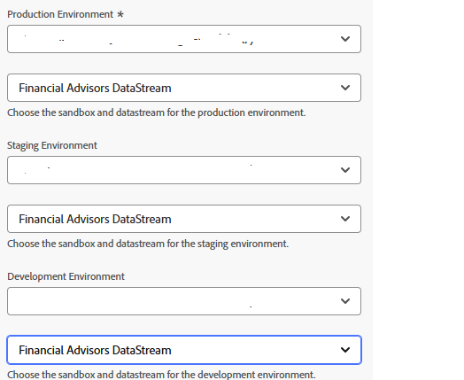
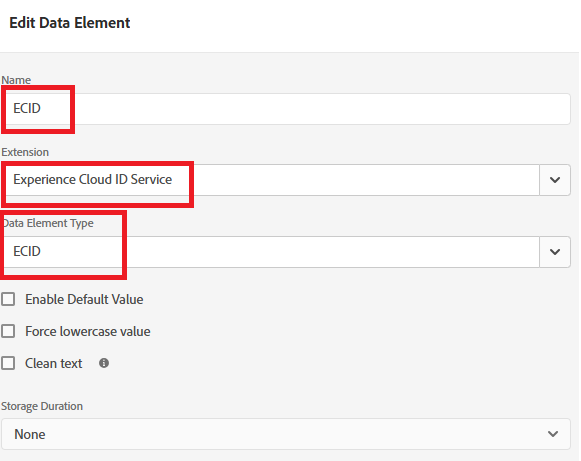

# Criar Adobe Experience Platform

O Adobe Launch está configurado na página da Web para carregar o Adobe Experience Platform Web SDK, permitindo que a chamada da API sendEvent acione experiências personalizadas. Essa configuração garante que as bibliotecas do lado do cliente necessárias sejam inicializadas corretamente, permitindo a interação em tempo real com a Adobe Journey Optimizer para a entrega de ofertas.

* Fazer logon na Coleção de dados
* Clique em Tags -> Nova propriedade
* Crie uma tag Adobe Experience Platform chamada ECID Service.

* Adicionar as seguintes extensões à tag
  

* Certifique-se de configurar o Adobe Experience Platform Web SDK para usar o ambiente correto e o DataStream dos consultores financeiros criados no tutorial anterior
  

* Nenhuma configuração adicional é necessária para a Camada de dados de clientes Adobe e as Extensões principais

## Criar elemento de dados

O elemento de dados ECID no Adobe Launch é criado apenas para fins de depuração e teste. Ele permite que os desenvolvedores visualizem a Experience Cloud ID atribuída à sessão do navegador de um usuário, o que pode ajudar a validar a identificação e garantir que as chamadas sendEvent estejam associadas ao perfil correto. Esse elemento não é necessário para que a personalização funcione, mas é útil durante a implementação e o QA




## Incluir tags do AEP na página do HTML

Criar e publicar as tags do Adobe Experience Platform

Quando uma propriedade de Tags do AEP é publicada, o Adobe fornece uma tag de script que você deve colocar dentro da HTML ``` <head>``` ou na parte inferior das tags ``` <body>```.

* Vá para a propriedade Tags (ECID Service).

* Clique em Ambientes e clique no ícone de instalação do ambiente desejado (por exemplo, Desenvolvimento, Armazenamento temporário, Produção).

* Anote o código incorporado. Esse código precisa ser colocado antes da marca de fechamento ```</body>``` na página do HTML.

