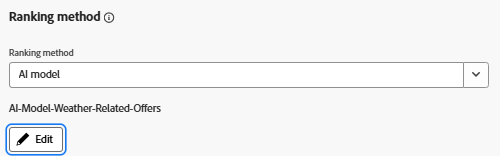

# Captura de interações de oferta com o Adobe Web SDK para treinamento do modelo de IA

>[!NOTE]
>
> Preencha este artigo somente se você planejar usar métodos de classificação baseados em IA no Adobe Journey Optimizer para personalizar qual oferta é exibida com base no envolvimento previsto.


Este artigo demonstra como capturar eventos de interação de oferta (como impressões ou cliques) usando o Adobe Experience Platform Web SDK chamando alloy(&quot;sendEvent,&quot; ...) diretamente no código JavaScript. Os dados são assimilados na AEP e usados para treinar modelos de IA no Adobe Journey Optimizer (AJO) para uma classificação de ofertas mais inteligente com base no comportamento em tempo real.

Para criar um modelo de IA para a classificação de ofertas no Adobe Journey Optimizer, seu conjunto de dados deve ser baseado em um esquema que inclua o grupo de campos Interações de apresentação. Esse grupo de campos é compatível com eventos importantes de decisão, como decisioning.propositionDisplay e decisioning.propositionInteract, juntamente com campos obrigatórios, como engagePropositions, display e interage.

Há duas abordagens válidas para alcançar isso:

- Criar um novo esquema, conjunto de dados e sequência de dados configurados especificamente para rastreamento de interação
- Atualizar um esquema existente — que é o que é feito neste tutorial


## Atualizar esquema existente para capturar eventos de interação de oferta

Em vez de criar um novo esquema, o esquema Evento de experiência existente usado para ofertas relacionadas ao clima é atualizado para oferecer suporte ao rastreamento de interação.

No Adobe Experience Platform:

- Abra o _**Esquema de Meteorologia**_ existente. Esquema de Evento de Experiência que você está usando para ofertas baseadas em clima.

- Adicionar o grupo de campos:
Evento de experiência - Interações de apresentação

Não é necessário criar um novo conjunto de dados ou sequência de dados — continue usando a configuração existente para ofertas meteorológicas. Os eventos enviados estão alinhados às expectativas da Adobe Journey Optimizer para modelos de IA de treinamento e rastreamento de desempenho da oferta.


Continuar usando o conjunto de dados atual (não é necessário criar um novo)

O fluxo de dados existente já está configurado e em uso na propriedade Tags do Adobe Experience Platform — nenhuma alteração é necessária.

O Web SDK roteia automaticamente novos eventos de interação para o destino correto.

Essa configuração simplificada garante que todas as decisões e eventos climáticos sejam assimilados em um único conjunto de dados unificado, ideal para treinar modelos de IA no Adobe Journey Optimizer.


## Capturar eventos de exibição da oferta (impressões)

A estrutura HTML da oferta foi modificada para incluir elementos interativos — especificamente as tags `<a>` e `<button>` — permitindo que os usuários se envolvam com a oferta (por exemplo, os botões &quot;Oferta de solicitação&quot; ou &quot;Saiba mais&quot;).

Cada botão inclui um atributo data-offer-id para que a interação correspondente possa ser rastreada adequadamente.


Para registrar quando as ofertas são exibidas aos usuários, o arquivo do JavaScript existente usado para renderizar ofertas meteorológicas foi atualizado para incluir o rastreamento de eventos de exibição.

Um evento decisioning.propositionDisplay agora é enviado usando o Adobe Web SDK (alloy.sendEvent) quando uma ou mais ofertas são exibidas. Esse evento inclui a exibição necessária: 1 sinalizador e faz referência às apresentações envolvidas.


```javascript
if (offerIds.length > 0) {
  alloy("sendEvent", {
    xdm: {
      _id: generateUUID(),
      timestamp: new Date().toISOString(),
      eventType: "decisioning.propositionDisplay",
      _experience: {
        decisioning: {
          propositionEvent: {
            display: 1
          },
          involvedPropositions: offerIds.map(id => ({
            id,
            scope: "web://gbedekar489.github.io/weather/weather-offers.html#offerContainer"
          }))
        }
      }
    }
  });
}
```

## Capturar Eventos De Clique Da Oferta (Interações)

Para monitorar quando um usuário clica em uma oferta, atualizamos o JavaScript existente para ouvir cliques nos elementos `<a>` e `<button>` renderizados no contêiner de oferta.

Quando um clique é detectado, um evento decisioning.propositionInteract é enviado usando o Adobe Web SDK. O evento inclui a interação necessária: 1 sinalizador e faz referência à ID de oferta específica e ao escopo de decisão.

```javascript
// Attach click tracking to <a> and <button> elements
wrapper.querySelectorAll("a, button").forEach(el => {
  el.addEventListener("click", () => {
    const offerId = el.getAttribute("data-offer-id") || item.id;
    console.log("Clicked element offerId:", offerId);

    alloy("sendEvent", {
      xdm: {
        _id: generateUUID(),
        timestamp: new Date().toISOString(),
        eventType: "decisioning.propositionInteract",
        _experience: {
          decisioning: {
            propositionEvent: {
              interact: 1
            },
            involvedPropositions: [{
              id: offerId,
              scope: "web://gbedekar489.github.io/weather/weather-offers.html#offerContainer"
            }]
          }
        }
      }
    });
  });
});
```

## Criar um modelo de IA para classificação de ofertas no Adobe Journey Optimizer Offer Decisioning

Com o, impressões de ofertas e cliques agora capturados por meio do Web SDK e armazenados no Adobe Experience Platform, esses dados podem ser usados para treinar um modelo de IA que prevê quais ofertas têm maior probabilidade de impulsionar o engajamento.

Esse modelo de IA é referenciado em uma fórmula de classificação ou estratégia de seleção para determinar quais ofertas são priorizadas para cada usuário.
- Fazer logon no Journey Optimizer
- Navegue até Decisão -> Configuração da estratégia -> Modelos de IA -> Criar modelo de IA
- Certifique-se de usar o conjunto de dados correto
  
- Salve e ative o modelo de IA.
- Atualize a estratégia de seleção criada na etapa anterior para usar o modelo de IA para o método de Classificação
  

## Testar a solução

Incluir o [arquivo JavaScript atualizado](assets/ai-model.js) na [página da Web existente](assets/weather-offers.html)