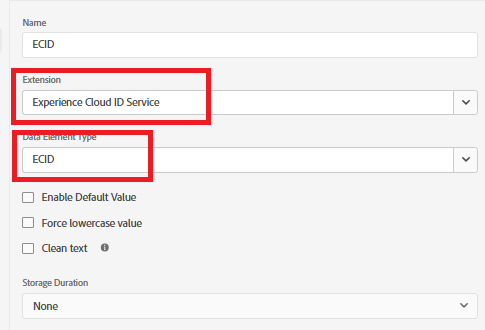

# Criação de tags do Adobe Experience Platform

As Tags do Adobe Experience Platform (antigo Adobe Launch) ajudam a gerenciar e implantar* tecnologias de marketing e análise no seu site sem precisar alterar o código do site.

Este [vídeo descreve o processo de criação de Tags de Experiência do Adobe](https://experienceleague.adobe.com/pt-br/playlists/experience-platform-get-started-with-tags)

* Fazer logon na Coleção de dados
* Clique em _&#x200B;**Marcas -> Nova propriedade**
* Crie uma Marca do Adobe Experience Platform chamada _&#x200B;**personalization-on-weather**&#x200B;_.
* Adicionar as seguintes extensões à tag

* Adicione um elemento de dados chamado &quot;ECID&quot;, como mostrado abaixo. Esse elemento de dados é usado posteriormente nos relatórios

* Certifique-se de configurar o Adobe Experience Platform Web SDK para usar o ambiente correto e o **datastream relacionado ao clima** criado na etapa anterior.

## Criar e implantar as tags do AEP

Crie uma nova biblioteca e adicione todos os recursos modificados a ela, conforme ilustrado nas capturas de tela abaixo.

**Adicionar biblioteca**

**Criar uma biblioteca**

Na tela Criar biblioteca, especifique o nome da biblioteca e o ambiente.

Adicionar todos os recursos alterados a esta biblioteca

Clique no botão Salvar e criar no desenvolvimento para criar a biblioteca

## Incluir tags do AEP na página do HTML

Ao publicar uma propriedade de Marcas do AEP, a Adobe fornece uma marca de script que você deve colocar dentro da HTML ` <head>` ou na parte inferior das marcas ` <body>`.

1. Vá para a propriedade Tags (personalização no clima).
2. Clique em Ambientes e clique no ícone de instalação do ambiente desejado (por exemplo, Desenvolvimento, Armazenamento temporário, Produção).
3. Anote o código incorporado. Ela é necessária em um estágio posterior deste tutorial.
