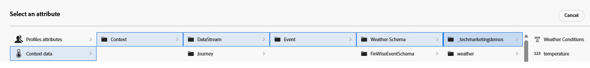

# Criar fórmula de classificação

Uma fórmula de classificação no Adobe Journey Optimizer é usada durante o Offer Decisioning, especificamente em uma estratégia de seleção para determinar a ordem de prioridade das ofertas elegíveis. A fórmula de classificação entra em ação após a filtragem de qualificação, quando várias ofertas se qualificam para um determinado perfil, mas somente a principal (ou algumas) deve ser apresentada com base na lógica de negócios ou no contexto do perfil.

* Fazer logon no Journey Optimizer

* Navegue até _&#x200B;**Decisão ->Configuração da estratégia ->Fórmulas de classificação ->Criar fórmula**&#x200B;_

Nomeie a fórmula _&#x200B;**Clima - Relacionado - Ofertas**&#x200B;_

Um critério em uma fórmula de classificação refere-se a uma regra condicional usada para atribuir uma pontuação a uma oferta. Esses critérios comparam atributos da oferta e o contexto para determinar a relevância de uma oferta para um indivíduo específico.

Os 3 critérios a seguir são definidos para filtrar ofertas e atribuir uma pontuação de classificação à oferta qualificada. Os critérios são definidos usando o construtor de critérios. Os dados de contexto também podem ser usados na definição dos critérios, como mostrado na captura de tela abaixo

Todos os três critérios usaram um atributo de oferta (tag) e um atributo de dados de contexto (temperatura) na definição dos critérios.

## Critério um

| **Marca da oferta** | **Condição de dados de contexto** | **Lógica de pontuação** |
|------------------|---------------------|-------------------------------------|
| **quente** | temperatura > 80 | score=Temperatura |

## Critério dois

| **Marca de Tempo** | **Condição de dados de contexto** | **Lógica de pontuação** |
|------------------|---------------------------|----------------------------------------------|
| **primavera** | temperatura > 65 e &lt; 80 | pontuação=temperatura × 4 |

## Critério três

| **Marca de Tempo** | **Condição de dados de contexto** | **Lógica de pontuação** |
|------------------|---------------------------|----------------------------------------------|
| **frio** | temperatura &lt; 65 | pontuação =temperatura |
