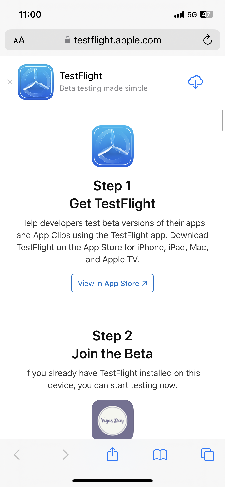
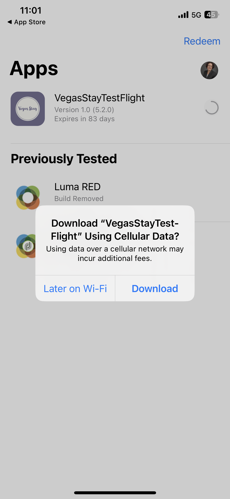

# Summit Lab L731 - Folha de dicas

Esta página contem texto e links que estão sendo usados no Summit Lab L731. Ele permite copiar e colar o conteúdo nas suas mensagens do Journey Optimizer.

## Exercício 1.1: baixar e instalar o aplicativo

Digitalize o código QR para baixar o aplicativo

>[!BEGINTABS]

>[!TAB iOS]

Você será solicitado a instalar o Testflight, etapas 1 a 4. Depois de instalar o Testflight, siga as etapas 5 a 8 para instalar o aplicativo Vegas Stay:

<table>
<tr>
</tr>
<tr>
<td>
 

      

      <b>Etapa 1 </b>
      

      
      

  </td>
  <td>
 

      

      <b>Etapa 2 </b>
      

      
      

  </td>
  <td>
 

      

      <b>Etapa 3 </b>
      

      
      

  </td>
  <td>
 

      

      <b>Etapa 4 </b>
      

      
      

  </td>
  </tr>
  <tr>
<td>
 

      

      <b>Etapa 5 </b>
      

      
      

  </td>
  <td>
 

      

      <a>
      <b>Etapa 6 </b>
      

        
      </a>
      

  </td>
  <td>
 

      

      <a>
      <b>Etapa 7 </b>
      

        
      </a>
      

  </td>
  <td>
 

      

      <a>
      <b>Etapa 8 </b>
      

        
      </a>
      

  </td>
  </tr>
</table>

>[!TAB Android]

Se estiver usando o simulador para Android, use este link: [https://ajolab.s3.amazonaws.com/ajolabapp-release.apk](https://ajolab.s3.amazonaws.com/ajolabapp-release.apk)

Como o aplicativo não está registrado na Google Play Store, você receberá uma mensagem de aviso:

Clique em **Instalar mesmo assim**

>[!ENDTABS]

## Exercício 1.3: fazer logon no Adobe Journey Optimizer

[Clique aqui para fazer logon no Journey Optimizer](https://experience.adobe.com/#/@techmarketingdemos/sname:summit-2023-ajo-lab/journey-optimizer/home)

**Detalhes de logon:**

* **Nome de usuário:** `L731+<your seat number>@summitlab.us` (exemplo: L731+001@summitlab.us)
* **Senha:** Adobe2023!

## Exercício 2.1 - Criar uma campanha no aplicativo

| Campo | Texto | Links |
|----|----|----|
| Nome da campanha | `<your seat number> March Vegas Campaign` |  |
| Correspondência | booknow |  |
| Opção de URL de mídia |  | https://mcfadyen.com/wp-content/uploads/2023/01/Adobe-Summit-2023-Banner.png |
| Título | É agora e está ao vivo! |  |
| Corpo | O Adobe Summit voltará a Las Vegas de 21 a 23 de março de 2023. Prepare-se para palestrantes inspiradores, sessões de expansão de habilidades e novas conexões. |  |
| Botão | Reserve o hotel agora e economize 10% | lab://booking?suite=presidential&amp;discount=10 |
| Botão: evento interativo | CTA no aplicativo |  |
| URL básica |  | iOS: lab://  Android&amp;: https://lab |

## Lição 3 - Criar uma jornada omnicanal

**Rótulo de jornada:**
`<your seat number>` - Jornada de boas-vindas

>[!BEGINTABS]

>[!TAB Mensagem por push]

**Rótulo:**
Mensagem de boas-vindas

**Título:**\
Boas-vindas ao Vegas Stay.

**Corpo:**\
Faça o check-in no aplicativo móvel e evite filas

**Deeplink:** iOS: lab://, Android&amp;: https://lab

**Mídia:**

https://experienceleague.adobe.com/docs/journey-optimizer-learn/assets/vegas_online_check_in.jpg?lang=pt-BR

Esta é a imagem que estamos usando para a notificação por push:

>[!TAB Mensagem SMS]

**Rótulo:**
Mensagem de boas-vindas

**Mensagem:**
Boas-vindas ao Vegas Stay. Faça o check-in no aplicativo móvel e evite filas: lab://checkin

>[!TAB Mensagem de email]

**Rótulo:**
Mensagem de confirmação

**Linha de assunto:**
`{{profile.person.name.firstName}},` você fez o check-in, agora confira nossas ofertas para sua estadia.

>[!ENDTABS]
