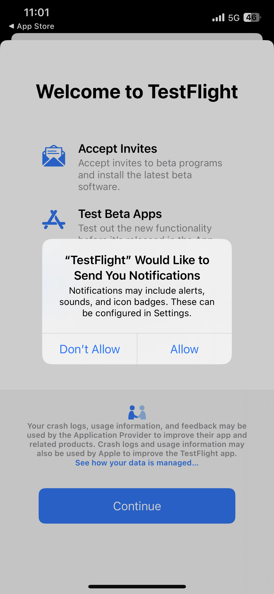
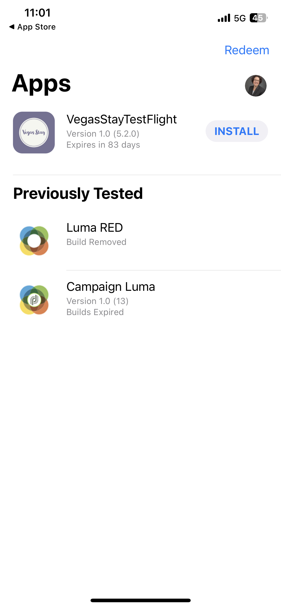
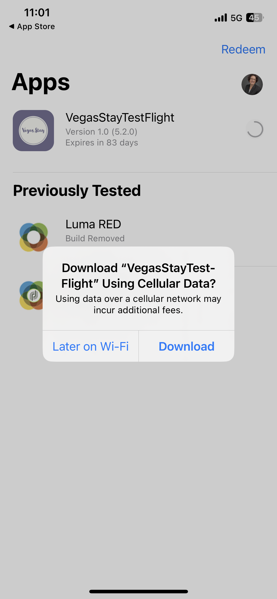
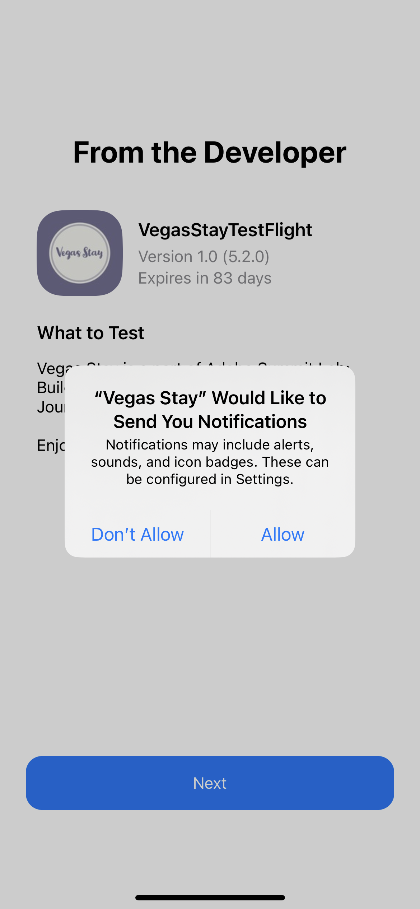

# Summit Lab L731 - Folha de características

Esta página contem texto e links que estão sendo usados no Summit Lab L731. Ele permite copiar e colar o conteúdo nas suas mensagens do Journey Optimizer.

## Exercício 1.1: baixar e instalar o aplicativo

Digitalize o código QR para baixar o aplicativo

>[!BEGINTABS]

>[!TAB iOS]

>[!IMPORTANT]
>
>Se solicitado a resgatar o código, feche o aplicativo TestFlight e digitalize o QR Code novamente.
>
>Permita notificações.
>

Você será solicitado a instalar o Testflight, etapas 1 a 4. Depois de instalar o Testflight, siga as etapas 5 a 8 para instalar o aplicativo Vegas Stay:

<table>
<tr>
</tr>
<tr>
<td>
 

      

      <b>Etapa 1 </b>
      

      
      

  </td>
  <td>
 

      

      <b>Etapa 2 </b>
      

      
      

  </td>
  <td>
 

      

      <b>Etapa 3 </b>
      

      
      

  </td>
  <td>
 

      

      <b>Etapa 4 </b>
      

      
      

  </td>
  </tr>
  <tr>
<td>
 

      

      <b>Etapa 5 </b>
      

      
      

  </td>
  <td>
 

      

      <a>
      <b>Etapa 6 </b>
      

        
      </a>
      

  </td>
  <td>
 

      

      <a>
      <b>Etapa 7 </b>
      

        
      </a>
      

  </td>
  <td>
 

      

      <a>
      <b>Etapa 8 </b>
      

        
      </a>
      

  </td>
  </tr>
</table>

>[!TAB Android]

Como o aplicativo não está registrado na Google Play Store, você receberá uma mensagem de aviso:

Clique em **Instalar mesmo assim**

>[!ENDTABS]

## Exercício 1: fazer logon no Adobe Journey Optimizer

[Clique aqui para fazer logon no Journey Optimizer](https://experience.adobe.com/#/@techmarketingdemos/sname:summit-2023-ajo-lab/journey-optimizer/home){target="_blank"}

**Detalhes de logon**

* **Nome de usuário:** `L731+<your seat number>@summitlab.us` (exemplo: L731+001@summitlab.us)
* **Senha:** Adobe2023!

## Exercício 2 - Criar uma campanha no aplicativo

| Seção | Campo | Texto | Links |
|----|----|----|----|
| **Propriedades** | Nome da campanha | `<your seat number> Vegas Stay Campaign` |  |
| **Triggers** | Estado | booknow |  |
| **Editar conteúdo:** Mídia | Opção de URL de mídia |  | https://i.ibb.co/NstLhjW/Firefly-Poster-with-heading-Adobe-Max-84773.jpg |
| **Editar conteúdo:** Conteúdo | Título | Obtenha o desconto antecipado. |  |
| **Editar conteúdo:** Conteúdo | Corpo | A Adobe Max volta para Las Vegas. Prepare-se para palestrantes inspiradores, sessões de expansão de habilidades e novas conexões. Reserve sua suíte agora e ganhe 10% de desconto. |  |
| **Editar conteúdo:** Botões | Botão | Receba 10% de desconto. | lab://booking?suite=presidential&amp;discount=10 |
| **Editar conteúdo:** Botões | Evento de interação | CTA no aplicativo |  |
| **Visualizar no dispositivo** | URL de base a ser usado para visualização no dispositivo |  | **iOS:** lab://  **Android**: https://lab |

## Exercício 3: criar uma notificação por push

| Campo | Texto | Links |
|----|----|----|
| Nome da campanha | **`<your seat number> Max Push Campaign`** |  |
| Título | Ei! |  |
| Corpo | Você sabia que a Adobe Max está voltando para Vegas? Reserve seu quarto agora e receba 10% de desconto. |  |
| Opção de URL de mídia |  | https://i.ibb.co/1M0BnZn/Firefly-Big-conference-big-stage-with-ADBE-text-on-screen-40178.jpg |
