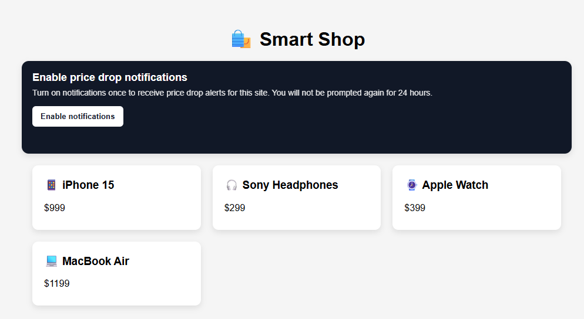

# Capturar permissão do usuário

Esta página da Web captura o consentimento do usuário para receber notificações por push. Ele solicita que o usuário ative notificações usando a API de notificações do navegador e, após a aceitação, registra a subscrição de push com o Adobe Experience Platform usando a Web SDK. Isso garante que somente os usuários aceitos possam receber notificações por push por meio de campanhas e jornadas no Adobe Journey Optimizer.

Para ativar as notificações por push da Web, a página primeiro carrega um arquivo de configuração chamando fetch(&quot;/config&quot;) dentro de uma função de inicialização. Essa configuração é fornecida por um aplicativo Node.js e inclui valores-chave, como ID de sequência de dados, ID da organização, chave pública VAPID, ID do aplicativo e ID do conjunto de dados de rastreamento. Depois que a configuração é carregada, o Adobe Web SDK é inicializado e o service worker é registrado para dar suporte a mensagens de push. Quando um usuário clica em Ativar notificações, o navegador solicita permissão usando a API de notificações da Web. Se a permissão for concedida, o Web SDK enviará a assinatura por push para o Adobe Experience Platform e o usuário será marcado como aceito por 24 horas para evitar prompts repetidos. Você pode experimentar esse fluxo na página da Web local shop-smart.html incluída no [aplicativo de amostra](http://localhost:3000/) após iniciar o servidor.

