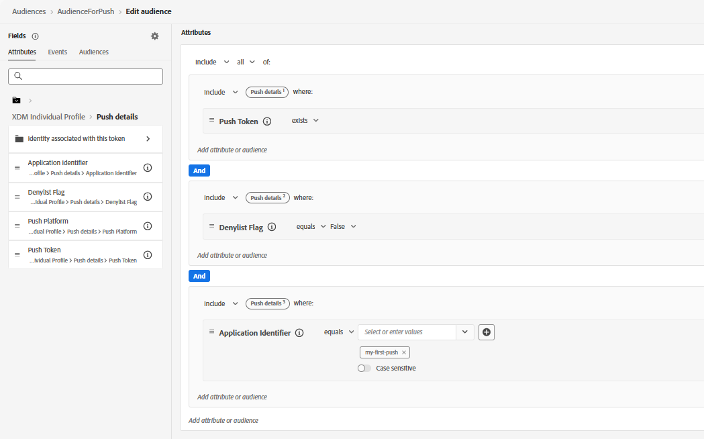

# Criar público-alvo

Para criar um público-alvo para a campanha, defina um segmento no Adobe Experience Platform que direcione os usuários qualificados a receber notificações por push. Neste tutorial, os usuários que têm uma assinatura de push ativa (o token de push existe), que não recusaram notificações (o sinalizador de Inclui na lista de bloqueios é falso) e estão associados à configuração de aplicativo especificada (o Identificador do aplicativo é igual a `my-first-push`). Esses usuários estão totalmente qualificados para receber notificações por push da Web por meio de campanhas ou jornadas no Adobe Journey Optimizer.Depois de criar o público-alvo, verifique se ele foi avaliado para que os perfis sejam preenchidos e estejam prontos para o direcionamento.
Esse público-alvo é usado na campanha para enviar mensagens de push da Web programadas somente para usuários inscritos.

