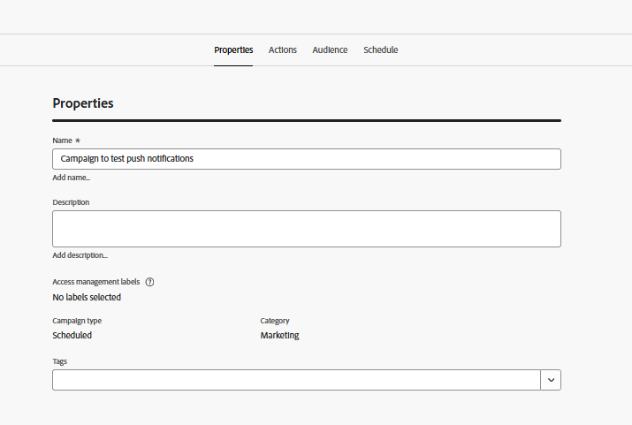
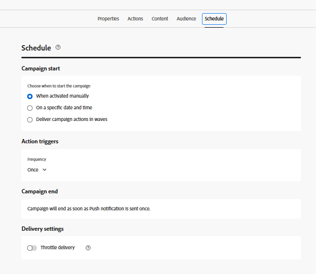

# Criar campanha

Nesta etapa, você criará uma campanha no Adobe Journey Optimizer para enviar notificações por push agendadas da Web aos usuários que aceitaram. A campanha é direcionada a um público elegível e entrega mensagens em um horário predefinido, permitindo um engajamento planejado e baseado no público.

* Fazer logon no Journey Optimizer
* Navegue até Gerenciamento de Jornadas | Campanhas | Criar campanhas

## Especificar Configurações de Campanha

Especificar o nome da campanha

## Associar ação à campanha

Associar a configuração de canal de push criada anteriormente neste tutorial

## Associar público-alvo à campanha

Associar a audiência `AudienceForPush` à campanha

## Criar conteúdo para a notificação por push

Crie conteúdo básico de push para testar a notificação por push. Especifique o título e o corpo da mensagem conforme mostrado abaixo

## Agendar a campanha

Programe a campanha de acordo com suas necessidades

Por fim, ative a campanha.

## Testar a campanha

Para testar a campanha, primeiro habilite as notificações na [página da Web optando por ](http://localhost:3000) quando solicitado. Depois de aceitar, aguarde a campanha ser executada no horário agendado. Quando a campanha for executada, você deverá receber a notificação por push em seu navegador.
