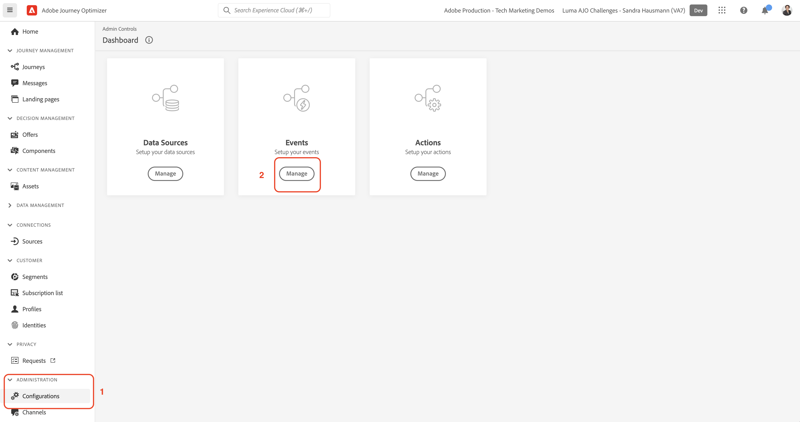

# Configurar eventos

Nesta seção, você configura os três eventos necessários para os exercícios práticos no [Desafios da Journey Optimizer](/help/challenges/introduction-and-prerequisites.md).

Assista ao vídeo [Criar eventos](/help/set-up-journeys/create-events.md) para obter orientação sobre como criar eventos.

## Crie o evento de compra online Luma

1. Na navegação à esquerda, navegue até [!UICONTROL ADMINISTRAÇÃO] e selecione *[!UICONTROL Configuração]*
1. No [!UICONTROL Painel], selecione *[!UICONTROL Gerenciar*]* Eventos

1. Clique em *[!UICONTROL Criar evento]*
1. Preencha os detalhes e parâmetros do evento:

   | [!UICONTROL Parâmetro] | [!UICONTROL Valor] |
   |-------------|-----------|
   | [!UICONTROL NOME] | `LumaOnlinePurchase` |
   | [!UICONTROL TIPO] | [!UICONTROL Unitário] |
   | [!UICONTROL Tipo de ID do evento] | [!UICONTROL Baseado em regras] |
   | [!UICONTROL Esquema] | Interações do produto Luma |
   | [!UICONTROL Campos] | EventType  Order.priceTotal purchaseOrderNumber productListItems.quantity <b>Em Itens da Lista de Produtos > Esquema do Catálogo de Produtos Luma > _*[!DNL yourOrganizationID]* > Produto:</b>   Nome Preço ProductImageURL ProductURL |

1. Adicione o [!UICONTROL Condição de ID de evento]: **[!DNL LumaOnlinePurchase.eventType is commerce.purchases]**

   1. Selecione o ícone de lápis para editar o campo
   2. No [!UICONTROL Adicionar uma condição de ID de evento] modal, arraste e solte a variável `eventType` sobre a tela
   3. Selecione `commerce.purchases`
   4. Selecione ok na tela
   5. Selecione ok no modal

1. Selecionar [!UICONTROL NAMESPACE]: `Luma CRM ID (lumaCrmId)`

2. Selecione **[!UICONTROL Salvar]**.

## Criar *[!DNL Luma Wishlist Add]* Evento

| [!UICONTROL Parâmetro] | [!UICONTROL Valor] |
|-------------|-----------|
| [!UICONTROL NOME] | `LumaWishlistAdd` |
| [!UICONTROL TIPO] | [!UICONTROL Unitário] |
| [!UICONTROL Tipo de ID do evento] | [!UICONTROL Baseado em regras] |
| [!UICONTROL Esquema] | `Luma Product Interactions` |
| [!UICONTROL Campos] | EventType productListItem.quantity <b>Em Itens da lista de produtos > Produtos Luma > _*[!DNL yourOrganizationID]* > Produto:</b>  Nome Preço  ProductImageURL ProductURL |
| [!UICONTROL Condição] | [!DNL LumaWishlistAdd.eventType is commerce.saveForLaters] |
| [!UICONTROL Namespace] | Email(Email) |

## Criar *[!DNL Luma Product Restock] Evento

| [!UICONTROL Parâmetro] | [!UICONTROL Valor] |
|-------------|-----------|
| [!UICONTROL NOME] | `LumaProductRestock` |
| [!UICONTROL TIPO] | [!UICONTROL Business] |
| [!UICONTROL Esquema] | [!DNL Luma Product Inventory Events] |
| [!UICONTROL Campos] | productID   stockEventType <b>Em Produto > Produtos Luma > *[!DNL yourOrganizationID]* > Produto:</b>  Nome Preço  ProductImageURL Descrição |
| [!UICONTROL Condição] | LumaProductRautomaticamente._`your organization's ID`.inventoryEvent.stockEventType é restock |

## Parabéns

Sua sandbox está pronta para ser usada!
