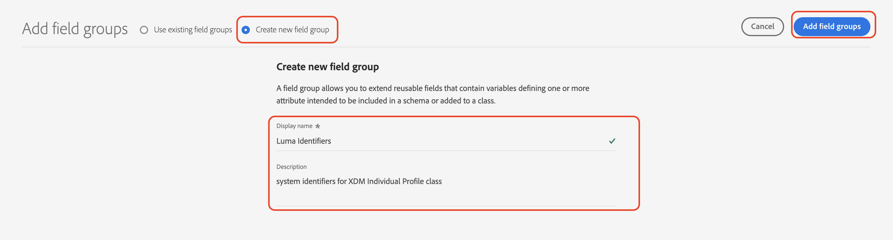

# Configurar dados manualmente

Nesta seção, você cria os namespaces de identidade necessários e define o [!DNL Luma] exemplo de estrutura de dados criando o [[!UICONTROL schemas]](https://experienceleague.adobe.com/docs/experience-platform/xdm/schema/composition.html?lang=pt-BR).

>[!TIP]
>Assista ao tutorial em vídeo [Mapear identidades](/help/set-up-data/map-identities.md) antes de começar.

## Etapa 1: criar namespaces de identidade

Nesta etapa, você cria namespaces de identidade para o [!DNL Luma] campos de identidade personalizados chamados `lumaLoyaltyId`, `lumaCrmId`, e `lumaProductSKU`. Os namespaces de identidade desempenham uma função crítica na criação de perfis de clientes em tempo real, pois dois valores correspondentes no mesmo namespace permitem que duas fontes de dados formem um gráfico de identidade.

Comece criando um [!UICONTROL namespace] para o [!DNL Luma Loyalty ID] esquema:

1. Na interface do usuário do Journey Optimizer, acesse **[!UICONTROL Cliente]** > **[!UICONTROL Identidades]** no painel de navegação esquerdo.

1. Selecionar **[!UICONTROL Criar namespace de identidade]**.

1. Forneça os seguintes detalhes:

   | Nome de exibição | Símbolo de identidade | Tipo |
   |---|---|---|
   | `Luma Loyalty ID` | `lumaLoyaltyId` | [!UICONTROL ID entre dispositivos] |

1. Selecione **[!UICONTROL Criar]**.

   

1. Crie mais dois namespaces seguindo as mesmas etapas:

   | Nome de exibição | Símbolo de identidade | Tipo |
   |---|---|---|
   | `Luma CRM ID` | `lumaCrmId` | [!UICONTROL ID entre dispositivos] |
   | `Luma Product SKU` | `lumaProductSKU` | [!UICONTROL Identificador não pessoal] |

## Etapa 2: Criar esquemas

Nesta etapa, você define a estrutura dos dados de amostra criando seis [[!UICONTROL schemas]](https://experienceleague.adobe.com/docs/experience-platform/xdm/schema/composition.html?lang=pt-BR):

* [[!DNL Luma Loyalty Schema]](#create-luma-loyalty-schema)

* [[!DNL Luma Product Catalog Schema]](#create-luma-product-catalog-schema)

* [[!DNL Luma Product Inventory Events] Esquema](#create-luma-product-inventory-event-schema)

* [[!DNL Luma CRM Schema]](#create-luma-crm-and-luma-product-interactions-schemas)

* [[!DNL Luma Web Events Schema]](#create-luma-crm-and-luma-product-interactions-schemas)

* [[!DNL Luma Offline Purchase Events Schema]](#create-additional-schemas)

* [[!DNL Luma Test Profiles Schema]](#create-additional-schemas)

>[!TIP]
>
>Assista ao tutorial em vídeo: [Criar um esquema](/help/set-up-data/create-schema.md) antes de começar.

### Criar [!DNL Luma Loyalty Schema] {#create-luma-loyalty-schema}

Esta seção descreve como criar o [!DNL Luma Loyalty] esquema e configurar grupos de campos.

#### Criar o esquema

1. Ir para **[!UICONTROL GERENCIAMENTO DE DADOS]** > **[!UICONTROL Esquemas]** no painel de navegação esquerdo.

1. Selecionar **[!UICONTROL Criar esquema]** no canto superior direito.

1. No menu suspenso, selecione **[!UICONTROL Perfil individual XDM]**.

   Você seleciona esta opção porque está modelando atributos de um cliente individual (pontos, status, etc.).

#### Adicionar grupos de campos existentes

Em seguida, você será solicitado a adicionar grupos de campos ao esquema, usando grupos. Você deve adicionar grupos de campos existentes e criar um grupo de campos.

1. No [!UICONTROL Esquema] , se o modal Grupos de campos não tiver sido aberto automaticamente, selecione **[!UICONTROL Adicionar]**.

   

1. No **[!UICONTROL Adicionar grupos de campos]** ative os seguintes grupos de campos:

   * **[!UICONTROL Detalhes demográficos]** para dados básicos do cliente, como nome e data de nascimento.

   * **[!UICONTROL Detalhes de contato pessoal]** para obter detalhes básicos de contato, como endereço de email e número de telefone.

   * **[!UICONTROL Detalhes de fidelidade]** para obter os detalhes de fidelidade, como pontos, data de ingresso ou status. O grupo de campos de fidelidade está muito abaixo da lista, portanto, é mais fácil pesquisá-lo.

1. Selecionar **[!UICONTROL Adicionar grupo de campos]** para adicionar todos os três grupos de campos ao esquema.

   

1. Selecione o nó superior do esquema.

1. Enter `Luma Loyalty Schema` como o **[!UICONTROL Nome de exibição]**.

#### Criar um [!UICONTROL grupo de campos] {#create-field-group}

Para ajudar a garantir a consistência entre os esquemas, o Adobe recomenda gerenciar todos os identificadores do sistema em um único grupo:

1. No **[!UICONTROL Composição]** seção em [!UICONTROL Grupos de campos], selecione **[!UICONTROL Adicionar]**.

1. Selecionar **[!UICONTROL Criar novo grupo de campos]**.

1. Adicionar `Luma Identity Profile Field Group` como o **[!UICONTROL Nome de exibição]**.

1. Adicionar `system identifiers for XDM Individual Profile class` como o **[!UICONTROL Descrição]**.

1. Selecione **[!UICONTROL Adicionar grupos de campos]**.

   

#### Adicionar campos ao novo [!UICONTROL grupo de campos]

O novo grupo de campos vazio é adicionado ao esquema. Usando os botões +, você pode adicionar novos campos a qualquer local na hierarquia. Nesse caso, você deve adicionar campos no nível raiz:

1. Selecionar **[!UICONTROL +]** ao lado do nome do schema.

   Essa etapa adiciona um campo em **sua id de locatário** namespace, para gerenciar conflitos entre seus campos personalizados e quaisquer campos padrão.

1. No **[!UICONTROL Propriedades do campo]** adicione os detalhes do novo campo:

   * **Nome do campo:** `systemIdentifier`

   * **[!UICONTROL Nome de exibição]:** `System Identifier`

   * **Tipo:** Objeto

   * **[!UICONTROL Atribuir grupo de campos]:** [!DNL Luma identifiers]

1. Selecione **[!UICONTROL Aplicar]**.

   

   Adicione dois campos abaixo de `systemIdentifier` objeto:

   | [!UICONTROL Nome do campo] | [!UICONTROL Nome de exibição] | [!UICONTROL Tipo] |
   |-------------|-----------|----------|
   | `loyaltyId` | `Loyalty Id` | [!UICONTROL String] |
   | `crmId` | `CRM Id` | [!UICONTROL String] |

#### Definir identidades

Agora você tem o [!UICONTROL namespace] e a variável [!DNL Luma Loyalty schema] configurado. Antes de assimilar dados, você deve rotular os campos de identidade. Cada esquema usado com [!UICONTROL Perfil do cliente em tempo real] O deve ter uma identidade primária especificada e cada registro assimilado deve ter um valor para esse campo.

1. Defina o **Identidade principal**:

   No **[!DNL Luma Loyalty Schema]**:

   1. Selecione o **[!DNL Luma Identity Profile Field Group]**.

   2. Selecione o campo **[!DNL loyaltyId]**.

   3. No **[!UICONTROL Propriedades do campo]**, ative o **[!UICONTROL Identidade]** caixa.

   4. Ativar o **[!UICONTROL Identidade principal]** caixa.

   5. Selecione o `Luma Loyalty Id` namespace de **[!UICONTROL Namespaces de identidade]** menu suspenso.

   6. Selecione **[!UICONTROL Aplicar]**.

      

2. Defina um **identidade secundária**:

   No **[!DNL Luma Loyalty Schema]**:

   1. Selecione o **[!DNL Luma Identity Profile Field Group]**.

   2. Selecione o campo `crmId`.

   3. No **[!UICONTROL Propriedades do campo]**, ative o **[!UICONTROL Identidade]** caixa.

   4. Selecione o `Luma CRM Id` namespace de **[!UICONTROL Namespaces de identidade]** lista suspensa.

   5. Selecione **[!UICONTROL Aplicar]**.

#### Ativar para perfil e salvar o esquema

1. Selecione o nó superior do esquema.

1. No [!UICONTROL Propriedades do campo], ativar **[!UICONTROL Perfil]**.

   O esquema deve ter esta aparência:

   

1. Selecione **[!UICONTROL Salvar]**.

### Criar [!DNL Luma Product Catalog Schema] {#create-luma-product-catalog-schema}

1. Ir para **[!UICONTROL GERENCIAMENTO DE DADOS]** > **[!UICONTROL Esquemas]** no painel de navegação esquerdo.

1. Selecionar **[!UICONTROL Criar esquema]** (canto superior direito).

1. Para criar uma classe, selecione **[!UICONTROL Procurar todos os tipos de esquema]** no menu suspenso.

1. Selecionar **[!UICONTROL Criar nova classe]**.

1. Adicione o nome de exibição: `Luma Product Catalog Class`.

1. Atribuir classe.

1. Criar um [!UICONTROL Grupo de campos]:

   * Nome de exibição: `Luma Product Catalog Field Group`

1. Adicione o seguinte campo à **[!DNL Luma Product Catalog Field Group]**.

   * Nome do campo: `product`

   * Nome de exibição: `Product`

   * Tipo: [!UICONTROL Objeto]

   * Grupo de campos: [!DNL Luma Product Catalog Field Group]

1. Selecione **[!UICONTROL Aplicar]**.

1. Adicione os seguintes campos à **[!DNL Product]** objeto:

   | [!UICONTROL Nome do campo] | [!UICONTROL Nome de exibição] | [!UICONTROL Tipo] |
   |-------------|-----------|----------|
   | `sku` | `Product SKU` | [!UICONTROL String] |
   | `name` | `Product Name` | [!UICONTROL String] |
   | `category` | `Product Category` | [!UICONTROL String] |
   | `color` | `Product Color` | [!UICONTROL String] |
   | `size` | `Product Size` | [!UICONTROL String] |
   | `price` | `Product Price` | [!UICONTROL Duplo] |
   | `description` | `Product Description` | [!UICONTROL String] |
   | `imageURL` | `Product Image URL` | [!UICONTROL String] |
   | `stockQuantity` | `Product Stock Quantity` | [!UICONTROL String] |
   | `url` | `Product URL` | [!UICONTROL String] |

1. Defina o **[!DNL SKU]** como identidade principal.
1. Adicione o **[!UICONTROL Nome de exibição]** `Luma Product Catalog Field Group` para o [!UICONTROL grupo de campos].

1. Selecione **[!UICONTROL Salvar]**.

### Criar [!DNL Luma Product Inventory Event Schema] {#create-luma-product-inventory-event-schema}

1. Ir para **[!UICONTROL GERENCIAMENTO DE DADOS]** > **[!UICONTROL Esquemas]** no painel de navegação esquerdo.

1. Selecione o **[!UICONTROL Criar esquema]** no canto superior direito.

1. No menu suspenso, selecione **[!UICONTROL Procurar todos os tipos de esquema]**.

1. Selecionar **[!UICONTROL Criar nova classe]**.

1. Adicione o nome de exibição: `Luma Business Event Class`.

1. Selecionar tipo: *[!UICONTROL Séries cronológicas]*.

1. Atribuir classe.

1. Criar um [!UICONTROL grupo de campos]:

   * Nome de exibição: `Luma Product Inventory Event Details Field Group`

1. Adicione o **[!UICONTROL Nome de exibição]** `Luma Product Inventory Event Schema` ao esquema.

1. Adicione o seguinte campo à **[!DNL Luma Product Inventory Event Details Field Group]**:

   * Nome do campo: `inventoryEvent`

   * Nome de exibição: `Inventory Event`

   * Tipo: [!UICONTROL Objeto]

   * Grupo de campos: `Luma Product Inventory Event Details Field Group`

1. Adicione os seguintes campos à `Product Inventory Event Details` objeto:

   | [!UICONTROL Nome do campo] | [!UICONTROL Nome de exibição] | [!UICONTROL Tipo] |
   |-------------|-----------|----------|
   | `sku` | `SKU` | [!UICONTROL String] |
   | `stockEventType` | `Stock Event Type` | [!UICONTROL String] |

   1. para definir o `stockEventType` para Enum, selecione o tipo: `string`.

   2. Role para baixo até a parte inferior da **[!UICONTROL Propriedades do campo]**.

   3. Ativar **[!UICONTROL Enum]**.

   4. Enter **[!UICONTROL valores] ([!UICONTROL label)]**: `restock` (`Restock`).

   5. Selecionar **[!UICONTROL Adicionar linha]**.

   6. Enter **[!UICONTROL valores] ([!UICONTROL label)]**: `outOfStock` (`Out of Stock`).

   7. Selecione **[!UICONTROL Aplicar]**.

      

1. Definir `inventory.Event.sku` campo como **[!UICONTROL identidade principal]** usando o **[!DNL LumaProductSKU namespace]**.

1. Selecione o `sku` e defina uma relação com a variável `product.sku` no campo **[!DNL Luma Product catalog Schema]** Esquema:

   1. Role para baixo até a parte inferior da **[!UICONTROL Propriedades do campo]**.

   2. Ativar **[!UICONTROL Relacionamento]**.

      1. **[!UICONTROL Esquema de referência]**: [!DNL Luma Product Catalog Schema].

      2. **[!UICONTROL Namespace de identidade de referência]**: [!DNL LumaProductSKU].
   3. Selecione **[!UICONTROL Aplicar]**.

      O esquema deve ter esta aparência:

      

1. Ativar para **Perfil**.

1. Selecionar [!UICONTROL Salvar] para salvar o esquema.

### Criar esquemas adicionais {#create-additional-schemas}

Crie o seguinte adicional [!UICONTROL schemas]:

| [!UICONTROL Nome de exibição] | [!DNL Luma CRM Schema] | [!DNL Luma Web Events Schema] | [!DNL Luma Test Profiles schema] | [!DNL Luma Offline Purchase Events Schema] |
|  ---| ------- | ---- |----|----|
| **[!UICONTROL Classe]** | [!UICONTROL Perfil individual XDM] | [!UICONTROL Evento de experiência XDM] | [!UICONTROL Perfil individual XDM] | [IUICONTROL XDM ExperienceEvent] |
| **[!UICONTROL Adicionar grupo de campos existente]** | `Luma Identity Profile Field Group` `Demographic Details` `Personal Contact Details` | `Orchestration eventID` `Consumer Experience Event` `AEP Web SDK ExperienceEvent` | `Luma Identity Profile Field Group` `Demographic Details` `Personal Contact Details` `Profile test details` | `Luma Identity Profile Field Group`  `Commerce Details` |
| **[!UICONTROL Relação]** |  | `productListItems.SKU`:  Esquema de referência `Luma Product Catalog Schema`  [!DNL Reference identity namespace] `lumaProductSKU` |  | `productListItems.SKU`:  Esquema de referência `Luma Product Catalog Schema`  [!DNL Reference identity namespace] `lumaProductSKU` |
| **[!UICONTROL Identidade principal] [!UICONTROL namespace])** | `systemIdentifier.crmId` |  | `systemIdentifier.crmId` | `systemIdentifier.LoyaltyId` |
| **[!UICONTROL Ativar para perfil]** | sim | sim | sim | sim |

## Próximas etapas

Agora que criou a estrutura de dados, você [criar conjuntos de dados e assimilar dados de amostra](/help/tutorial-configure-a-training-sandbox/manual-data-ingestion.md).
