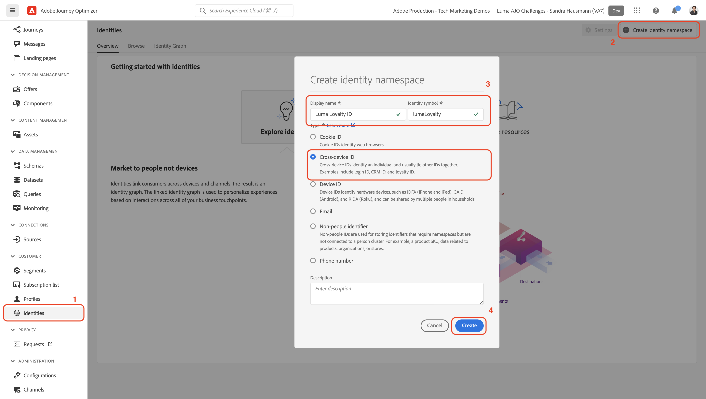

# Configurar dados manualmente

Nesta seção, você criará os namespaces de identidade necessários e definirá a estrutura de dados de amostra do [!DNL Luma] criando os [[!UICONTROL esquemas]](https://experienceleague.adobe.com/docs/experience-platform/xdm/schema/composition.html?lang=pt-BR).

>[!TIP]
>Assista ao tutorial em vídeo [Mapear identidades](/help/set-up-data/map-identities.md) antes de começar.

## Etapa 1: criar namespaces de identidade

Nesta etapa, você criará namespaces de identidade para os campos de identidade personalizados do [!DNL Luma] chamados `lumaLoyaltyId`, `lumaCrmId` e `lumaProductSKU`. Os namespaces de identidade desempenham uma função essencial na criação de perfis de clientes em tempo real, pois dois valores correspondentes no mesmo namespace permitem que duas fontes de dados formem um gráfico de identidade.

Comece criando um [!UICONTROL namespace] para o esquema [!DNL Luma Loyalty ID]:

1. Na interface do Journey Optimizer, acesse **[!UICONTROL Cliente]** > **[!UICONTROL Identidades]** no painel de navegação esquerdo.

1. Selecione **[!UICONTROL Criar namespace de identidade]**.

1. Forneça os seguintes detalhes:

   | Nome de exibição | Símbolo de identidade | Tipo |
   |---|---|---|
   | `Luma Loyalty ID` | `lumaLoyaltyId` | [!UICONTROL ID entre dispositivos] |

1. Selecione **[!UICONTROL Criar]**.

   

1. Crie mais dois namespaces seguindo as mesmas etapas:

   | Nome de exibição | Símbolo de identidade | Tipo |
   |---|---|---|
   | `Luma CRM ID` | `lumaCrmId` | [!UICONTROL ID entre dispositivos] |
   | `Luma Product SKU` | `lumaProductSKU` | [!UICONTROL Identificador não de pessoas] |

## Etapa 2: criar esquemas

Nesta etapa, você define a estrutura dos dados de amostra criando seis [[!UICONTROL esquemas]](https://experienceleague.adobe.com/docs/experience-platform/xdm/schema/composition.html?lang=pt-BR):

* [[!DNL Luma Loyalty Schema]](#create-luma-loyalty-schema)

* [[!DNL Luma Product Catalog Schema]](#create-luma-product-catalog-schema)

* [Esquema [!DNL Luma Product Inventory Events]](#create-luma-product-inventory-event-schema)

* [[!DNL Luma CRM Schema]](#create-luma-crm-and-luma-product-interactions-schemas)

* [[!DNL Luma Web Events Schema]](#create-luma-crm-and-luma-product-interactions-schemas)

* [[!DNL Luma Offline Purchase Events Schema]](#create-additional-schemas)

* [[!DNL Luma Test Profiles Schema]](#create-additional-schemas)

>[!TIP]
>
>Assista ao tutorial em vídeo [Criar um esquema](/help/set-up-data/create-schema.md) antes de começar.

### Criar [!DNL Luma Loyalty Schema] {#create-luma-loyalty-schema}

Esta seção descreve como criar o esquema do [!DNL Luma Loyalty] e configurar grupos de campos.

#### Criar o esquema

1. Acesse **[!UICONTROL GERENCIAMENTO DE DADOS]** > **[!UICONTROL Esquemas]** no painel de navegação esquerdo.

1. Selecione **[!UICONTROL Criar esquema]** no canto superior direito.

1. No menu suspenso, selecione **[!UICONTROL Perfil individual XDM]**.

   Esta opção deve ser selecionada porque você está modelando atributos de um cliente individual (pontos, status etc.).

#### Adicionar grupos de campos existentes

Em seguida, você será solicitado a adicionar grupos de campos ao esquema usando grupos. Você deve adicionar grupos de campos existentes e criar um grupo de campos.

1. Na página [!UICONTROL Esquema], se o modal Grupos de campos não tiver sido aberto automaticamente, selecione **[!UICONTROL Adicionar]**.

   

1. Na página **[!UICONTROL Adicionar grupos de campos]**, ative os seguintes grupos de campos:

   * **[!UICONTROL Detalhes demográficos]** para dados básicos do cliente, como nome e data de nascimento.

   * **[!UICONTROL Detalhes de contato pessoal]** para obter detalhes básicos de contato, como endereço de email e número de telefone.

   * **[!UICONTROL Detalhes de fidelidade]** para obter os detalhes de fidelidade, como pontos, data de ingresso ou status. O grupo de campos de fidelidade está bem abaixo na lista, por isso é mais fácil pesquisá-lo.

1. Selecione **[!UICONTROL Adicionar grupo de campos]** para adicionar todos os três grupos de campos ao esquema.

   

1. Selecione o nó superior do esquema.

1. Insira `Luma Loyalty Schema` como o **[!UICONTROL Nome de exibição]**.

#### Criar um [!UICONTROL grupo de campos] {#create-field-group}

Para ajudar a garantir a consistência entre os esquemas, a Adobe recomenda gerenciar todos os identificadores do sistema em um único grupo:

1. Na seção **[!UICONTROL Composição]**, em [!UICONTROL Grupos de campos], selecione **[!UICONTROL Adicionar]**.

1. Selecione **[!UICONTROL Criar novo grupo de campos]**.

1. Adicione `Luma Identity Profile Field Group` como o **[!UICONTROL Nome de exibição]**.

1. Adicione `system identifiers for XDM Individual Profile class` como a **[!UICONTROL Descrição]**.

1. Selecione **[!UICONTROL Adicionar grupos de campos]**.

   

#### Adicionar campos ao novo [!UICONTROL grupo de campos]

O novo grupo de campos vazio é adicionado ao esquema. Usando os botões +, é possível adicionar novos campos a qualquer local na hierarquia. Nesse caso, você deve adicionar campos no nível raiz:

1. Selecione **[!UICONTROL +]** ao lado do nome do esquema.

   Essa etapa adiciona um campo sob o namespace de **sua ID de locatário**, para gerenciar conflitos entre seus campos personalizados e quaisquer campos padrão.

1. Na barra lateral **[!UICONTROL Propriedades de campo]**, adicione os detalhes do novo campo:

   * **Nome do campo:** `systemIdentifier`

   * **[!UICONTROL Nome de exibição]:** `System Identifier`

   * **Tipo:** objeto

   * **[!UICONTROL Atribuir grupo de campos]:** [!DNL Luma identifiers]

1. Selecione **[!UICONTROL Aplicar]**.

   

   Adicione dois campos sob o objeto `systemIdentifier`:

   | [!UICONTROL Nome do campo] | [!UICONTROL Nome de exibição] | [!UICONTROL Tipo] |
   |-------------|-----------|----------|
   | `loyaltyId` | `Loyalty Id` | [!UICONTROL String] |
   | `crmId` | `CRM Id` | [!UICONTROL String] |

#### Definir identidades

Agora o [!UICONTROL namespace] e o [!DNL Luma Loyalty schema] estão configurados. Antes de assimilar dados, você precisa rotular os campos de identidade. Cada esquema usado com o [!UICONTROL perfil do cliente em tempo real] precisa ter uma identidade principal especificada e cada registro assimilado precisa ter um valor para esse campo.

1. Defina a **identidade principal**:

   Em **[!DNL Luma Loyalty Schema]**:

   1. Selecione o **[!DNL Luma Identity Profile Field Group]**.

   2. Selecione o campo **[!DNL loyaltyId]**.

   3. Nas **[!UICONTROL Propriedades do campo]**, ative a caixa **[!UICONTROL Identidade]**.

   4. Ative a caixa **[!UICONTROL Identidade principal]**.

   5. Selecione o namespace `Luma Loyalty Id` no menu suspenso **[!UICONTROL Namespaces de identidade]**.

   6. Selecione **[!UICONTROL Aplicar]**.

      

2. Defina uma **identidade secundária**:

   Em **[!DNL Luma Loyalty Schema]**:

   1. Selecione o **[!DNL Luma Identity Profile Field Group]**.

   2. Selecione o campo `crmId`.

   3. Nas **[!UICONTROL Propriedades do campo]**, ative a caixa **[!UICONTROL Identidade]**.

   4. Selecione o namespace `Luma CRM Id` na lista suspensa **[!UICONTROL Namespaces de identidade]**.

   5. Selecione **[!UICONTROL Aplicar]**.

#### Ativar para o perfil e salvar o esquema

1. Selecione o nó superior do esquema.

1. Nas [!UICONTROL Propriedades do campo], ative o **[!UICONTROL Perfil]**.

   O esquema deve ficar assim:

   

1. Selecione **[!UICONTROL Salvar]**.

### Criar [!DNL Luma Product Catalog Schema] {#create-luma-product-catalog-schema}

1. Acesse **[!UICONTROL GERENCIAMENTO DE DADOS]** > **[!UICONTROL Esquemas]** no painel de navegação esquerdo.

1. Clique em **[!UICONTROL Criar esquema]** (canto superior direito).

1. Para criar uma classe, selecione **[!UICONTROL Procurar todos os tipos de esquema]** no menu suspenso.

1. Selecione **[!UICONTROL Criar nova classe]**.

1. Adicione o nome de exibição: `Luma Product Catalog Class`.

1. Atribua a classe.

1. Crie um [!UICONTROL Grupo de campos]:

   * Nome de exibição: `Luma Product Catalog Field Group`

1. Adicione o seguinte campo ao **[!DNL Luma Product Catalog Field Group]**.

   * Nome do campo: `product`

   * Nome de exibição: `Product`

   * Tipo: [!UICONTROL objeto]

   * Grupo de campos: [!DNL Luma Product Catalog Field Group]

1. Selecione **[!UICONTROL Aplicar]**.

1. Adicione os seguintes campos ao objeto **[!DNL Product]**:

   | [!UICONTROL Nome do campo] | [!UICONTROL Nome de exibição] | [!UICONTROL Tipo] |
   |-------------|-----------|----------|
   | `sku` | `Product SKU` | [!UICONTROL String] |
   | `name` | `Product Name` | [!UICONTROL String] |
   | `category` | `Product Category` | [!UICONTROL String] |
   | `color` | `Product Color` | [!UICONTROL String] |
   | `size` | `Product Size` | [!UICONTROL String] |
   | `price` | `Product Price` | [!UICONTROL Duplo] |
   | `description` | `Product Description` | [!UICONTROL String] |
   | `imageUrl` | `Product Image URL` | [!UICONTROL String] |
   | `stockQuantity` | `Product Stock Quantity` | [!UICONTROL String] |
   | `url` | `Product URL` | [!UICONTROL String] |

1. Defina o **[!DNL SKU]** como a identidade principal.
1. Adicione o **[!UICONTROL Nome de exibição]** `Luma Product Catalog Field Group` ao [!UICONTROL grupo de campos].

1. Selecione **[!UICONTROL Salvar]**.

### Criar [!DNL Luma Product Inventory Event Schema] {#create-luma-product-inventory-event-schema}

1. Acesse **[!UICONTROL GERENCIAMENTO DE DADOS]** > **[!UICONTROL Esquemas]** no painel de navegação esquerdo.

1. Clique no botão **[!UICONTROL Criar esquema]** no canto superior direito.

1. No menu suspenso, selecione **[!UICONTROL Procurar todos os tipos de esquema]**.

1. Selecione **[!UICONTROL Criar nova classe]**.

1. Adicione o nome de exibição: `Luma Business Event Class`.

1. Selecione o tipo: *[!UICONTROL séries cronológicas]*.

1. Atribua a classe.

1. Crie um [!UICONTROL grupo de campos]:

   * Nome de exibição: `Luma Product Inventory Event Details Field Group`

1. Adicione o **[!UICONTROL Nome de exibição]** `Luma Product Inventory Event Schema` ao esquema.

1. Adicione o seguinte campo ao **[!DNL Luma Product Inventory Event Details Field Group]**:

   * Nome do campo: `inventoryEvent`

   * Nome de exibição: `Inventory Event`

   * Tipo: [!UICONTROL objeto]

   * Grupo de campos: `Luma Product Inventory Event Details Field Group`

1. Adicione os seguintes campos ao objeto `Product Inventory Event Details`:

   | [!UICONTROL Nome do campo] | [!UICONTROL Nome de exibição] | [!UICONTROL Tipo] |
   |-------------|-----------|----------|
   | `sku` | `SKU` | [!UICONTROL String] |
   | `stockEventType` | `Stock Event Type` | [!UICONTROL String] |

   1. Para definir o `stockEventType` como enumeração, selecione o tipo: `string`.

   2. Role para baixo até a parte inferior das **[!UICONTROL Propriedades do campo]**.

   3. Ative **[!UICONTROL Enumeração]**.

   4. Insira os **[!UICONTROL valores] ([!UICONTROL rótulo)]**: `restock` (`Restock`).

   5. Clique em **[!UICONTROL Adicionar linha]**.

   6. Insira os **[!UICONTROL valores] ([!UICONTROL rótulo)]**: `outOfStock` (`Out of Stock`).

   7. Selecione **[!UICONTROL Aplicar]**.

      

1. Defina o campo `inventory.Event.sku` como **[!UICONTROL identidade principal]** usando o **[!DNL LumaProductSKU namespace]**.

1. Selecione o campo `sku` e defina uma relação com o campo `product.sku` no esquema **[!DNL Luma Product catalog Schema]**:

   1. Role para baixo até a parte inferior das **[!UICONTROL Propriedades do campo]**.

   2. Ative a **[!UICONTROL Relação]**.

      1. **[!UICONTROL Esquema de referência]**: [!DNL Luma Product Catalog Schema].

      2. **[!UICONTROL Namespace de identidade de referência]**: [!DNL LumaProductSKU].

   3. Selecione **[!UICONTROL Aplicar]**.

      O esquema deve ficar assim:

      

1. Ative para o **Perfil**.

1. Clique em [!UICONTROL Salvar] para salvar o esquema.

### Criar esquemas adicionais {#create-additional-schemas}

Crie os seguintes [!UICONTROL esquemas] adicionais:

| [!UICONTROL Nome de exibição] | [!DNL Luma CRM Schema] | [!DNL Luma Web Events Schema] | [!DNL Luma Test Profiles schema] | [!DNL Luma Offline Purchase Events Schema] |
|  ---| ------- | ---- |----|----|
| **[!UICONTROL Classe]** | [!UICONTROL Perfil individual XDM] | [!UICONTROL Evento de experiência do XDM] | [!UICONTROL Perfil individual XDM] | [IUICONTROL XDM ExperienceEvent] |
| **[!UICONTROL Adicionar um grupo de campos já existente]** | `Luma Identity Profile Field Group` `Demographic Details` `Personal Contact Details` | `Orchestration eventID` `Consumer Experience Event` `AEP Web SDK ExperienceEvent` | `Luma Identity Profile Field Group` `Demographic Details` `Personal Contact Details` `Profile test details` | `Luma Identity Profile Field Group`  `Commerce Details` |
| **[!UICONTROL Relação]** |  | `productListItems.SKU`:  esquema de referência `Luma Product Catalog Schema`  [!DNL Reference identity namespace] `lumaProductSKU` |  | `productListItems.SKU`:  esquema de referência `Luma Product Catalog Schema`  [!DNL Reference identity namespace] `lumaProductSKU` |
| [!UICONTROL namespace] de **[!UICONTROL identidade principal])** | `systemIdentifier.crmId` | | `systemIdentifier.crmId` | `systemIdentifier.LoyaltyId` |
| **[!UICONTROL Habilitar para o perfil]** | sim | sim | sim | sim |

## Próximas etapas

Agora que criou a estrutura de dados, você pode [criar conjuntos de dados e assimilar dados de amostra](/help/tutorial-configure-a-training-sandbox/manual-data-ingestion.md).
