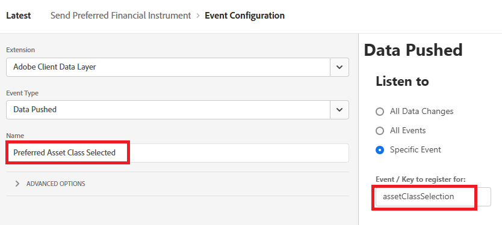
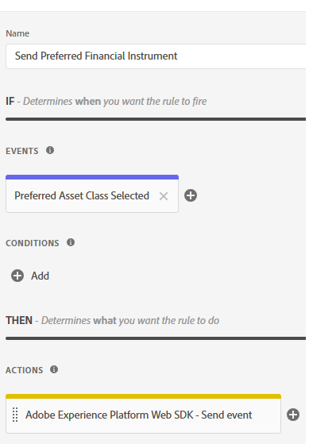

# Criação de tags do Adobe Experience Platform

As Tags do Adobe Experience Platform (antigo Adobe Launch) ajudam a gerenciar e implantar* tecnologias de marketing e análise no seu site sem precisar alterar o código do site.

Este [vídeo descreve o processo de criação de Tags de Experiência do Adobe](https://experienceleague.adobe.com/en/playlists/experience-platform-get-started-with-tags)

* Fazer logon na Coleção de dados
* Clique em Tags -> Nova propriedade
* Crie uma tag do Adobe Experience Platform chamada Supervisores financeiros.

* Adicionar as seguintes extensões à tag
  

* Certifique-se de configurar o Adobe Experience Platform Web SDK para usar o ambiente correto e o DataStream dos consultores financeiros criados na etapa anterior.
  

* Nenhuma configuração adicional é necessária para a Camada de dados de clientes Adobe e as Extensões principais

## Criar elementos de dados

Os elementos de dados são usados para coletar, organizar e fornecer dados em toda a tecnologia de marketing e publicidade baseada na Web.

Crie os seguintes elementos de dados

| Nome do elemento | Extensão | Tipo de elemento de dados | Comentários adicionais |
|------------------------------|-----------------------------------|-------------------|------------------------------------------------------------------------------------------------------------------------------------------------------------------|
| InstrumentoFinanceiroPreferencial | Núcleo | Custom Code | Consulte a nota abaixo |
| Objeto XDM | SDK da Web da Adobe Experience Platform | Objeto XDM | Selecione seu ambiente e o Esquema do Financial Advisors |


Para o código personalizado, abra o editor de código e copie e cole o seguinte código

```javascript
return window.adobeDataLayer
  ?.slice()
  .reverse()
  .find(event => event.event === "assetClassSelection")
  ?.xdm?.FinancialInterest?.PreferredFinancialInstrument || "undefined";
```

## Explicação do código

Examine a matriz adobeDataLayer (que armazena eventos que ocorrem em sua página da Web).

Faça uma cópia da matriz usando .slice() para que o original não seja alterado.

Inverta a ordem dos eventos para verificar primeiro os eventos mais recentes.

Localize o primeiro evento (começando pelo mais recente) em que event.event é exatamente &quot;assetClassSelection&quot;.

Se encontrado, acesse os dados xdm do evento e obtenha o valor de FinancialInterest.PreferredFinancialInstrument.

Se nada for encontrado, retorna a string &quot;indefinido&quot;


## Criar regra

O Construtor de regras em Tags do Adobe Experience Platform permite definir quando e como ações específicas devem ser executadas em seu site com base no comportamento do usuário ou em eventos.

* Crie uma regra chamada Enviar Instrumento Financeiro Preferencial. Esta regra contém um evento e uma ação


* Crie uma configuração de evento chamada Classe de ativo preferencial selecionada, conforme mostrado abaixo. Esse evento escuta os eventos assetClassSelection.




* Criar uma ação para enviar o esquema XDM atualizado para o AEP


* A regra final deve parecer com a abaixo



## Criar e implantar as tags do AEP


Crie uma nova biblioteca e adicione todos os recursos modificados a ela, conforme ilustrado nas capturas de tela abaixo.

Adicionar biblioteca


Criar uma biblioteca

Na tela Criar biblioteca, especifique o nome da biblioteca e o ambiente.
É necessário adicionar todos os recursos alterados a essa biblioteca


Clique no botão Salvar e criar no desenvolvimento para criar a biblioteca

## Incluir tags do AEP na página do HTML

Ao publicar uma propriedade de Marcas do AEP, a Adobe fornece uma marca de script que você deve colocar dentro da HTML ` <head>` ou na parte inferior das marcas `<body>`.

* Vá para a propriedade Tags(Financial Advisors).

* Clique em Ambientes e clique no ícone de instalação do ambiente desejado (por exemplo, Desenvolvimento, Armazenamento temporário, Produção).

* Anote o código incorporado. Ela é necessária em um estágio posterior deste tutorial.
