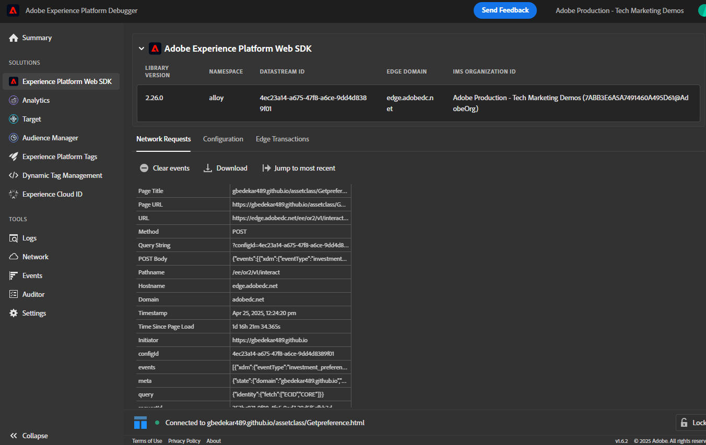

# Teste da solução

Para validar sua implementação, comece abrindo a página da Web que contém seu formulário de preferência. Use o DevTools do navegador (guias Console e Rede) para monitorar o processo de envio de formulários. Depois de enviar uma preferência (por exemplo, selecionar &quot;Estoques&quot;), confirme se o AEP Web SDK (alloy.sendEvent) foi acionado com êxito e se os dados corretos foram enviados para o Adobe Experience Platform. No AEP, navegue até a seção Públicos-alvo e verifique se seu perfil se qualifica para o público-alvo esperado (por exemplo, &quot;Interessado em estoques&quot;) dentro de alguns momentos, usando a segmentação do Edge. Você também pode inspecionar os dados de evento recebidos no conjunto de dados associado para garantir que eles contenham o valor de preferência correto. Repetir esse processo para cada classe de ativo (Ações, Títulos, CDs) para garantir que o fluxo de trabalho completo esteja funcionando corretamente.

## Dicas de solução de problemas

Se você não vir o perfil qualificado para o público-alvo desejado imediatamente, verifique o seguinte:

### Validar push da camada de dados do Adobe

* Abra as Ferramentas do desenvolvedor → Console do navegador.
* Digite console.log(window.adobeDataLayer);
* Confirme se um evento com o evento: &quot;assetClassSelection&quot; e o valor PreferredFinancialInstrument correto aparece após o envio do formulário

### Confirmar execução da regra do Launch

* Abra o Adobe Experience Platform Debugger (extensão do Chrome)
* Fazer logon no depurador
* Enviar o formulário
* Verifique se o evento DataPush para assetClassSelection foi capturado

A captura de tela a seguir do depurador deve ajudar você

### Obter a ECID

A ECID (Experience Cloud ID) é o identificador exclusivo contínuo da Adobe usado para reconhecer e unificar usuários em soluções e sessões da Experience Cloud.

* Ferramentas de desenvolvedor do Chrome → Guia Rede

* Filtrar por &quot;interagir&quot; ou &quot;coletar&quot;

* Enviar o formulário
* Clique na guia Resposta e anote a ECID

### Verificar a qualificação de perfil e público-alvo em tempo real

* Fazer logon no Journey Optimizer
* Ir para Clientes ->Perfis ->Procurar
* Procure a ECID que você recebeu da etapa anterior, como mostrado na captura de tela
  
* Clique no perfil e selecione a guia events para verificar se investment_preferred_event está listado
  
* Abra o json associado ao evento e verifique se ele contém os dados corretos do evento.

### Dicas adicionais de solução de problemas

* Verifique se o esquema e o perfil do conjunto de dados estão ativados.
* Certifique-se de que a Segmentação do Edge esteja ativada para o público-alvo para que a qualificação ocorra em tempo quase real.
* Esperar alguns minutos e atualizar a visualização de Públicos-alvo também pode ajudar, especialmente se estiver testando logo após a publicação das alterações.
* Verifique se as regras de público-alvo estão definidas corretamente e se fazem referência aos nomes e valores exatos dos campos capturados no envio do formulário.

