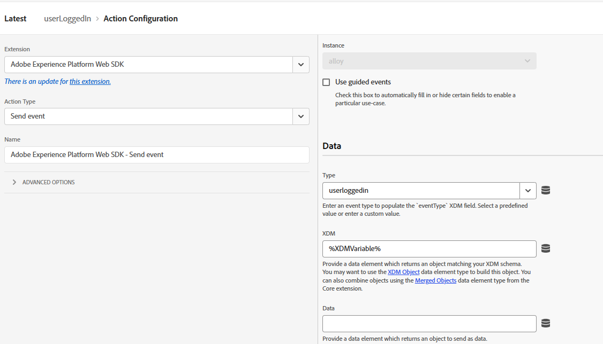

# Enviar CRMID para o Adobe Experience Platform

O Adobe Launch (Tags) é usado para enviar a CRMID para o Adobe Experience Platform (AEP), pois fornece um mecanismo flexível e orientado por eventos para transmitir dados de identidade diretamente do navegador. Enviar o CRMID após o logon do usuário permite que o AEP vincule o ECID anônimo ao perfil de CRM conhecido, permitindo a identificação precisa da identidade. Esse vínculo forma a base para a criação de perfis unificados de clientes, a qualificação de públicos e o fornecimento de experiências personalizadas em tempo real no Adobe Journey Optimizer (AJO).

Uma propriedade de Tags da AEP chamada FinWise é criada. As seguintes extensões foram adicionadas à propriedade Tags

Configure a extensão do AEP Web SDK usando o DataStream dos Supervisores Financeiros criado na etapa anterior.
O Serviço da Experience Cloud ID é uma extensão opcional adicionada à propriedade da tag para fins de depuração.

## Marcar elementos de dados

Crie os seguintes elementos de dados

| Elemento de dados | Extensão | Tipo de elemento de dados | Configurações personalizadas |
|--------------|-----------------------------------|---------------------------|----------------------------------------|
| crmid | Camada de dados de clientes Adobe | Estado calculado da camada de dados | user.crmid |
| ECID | Serviço da Experience Cloud ID | ECID |                                        |
| identidade | SDK da Web da Adobe Experience Platform | Mapa de identidade |  |
| XDMVariable | SDK da Web da Adobe Experience Platform | Variable |  |

## Criar regra

Crie uma regra chamada userLoggedin com o seguinte evento e ações

Evento

Atualizar ação de variável

Enviar ação do evento

## Salvar e criar

Salve as alterações, crie e crie a biblioteca.
