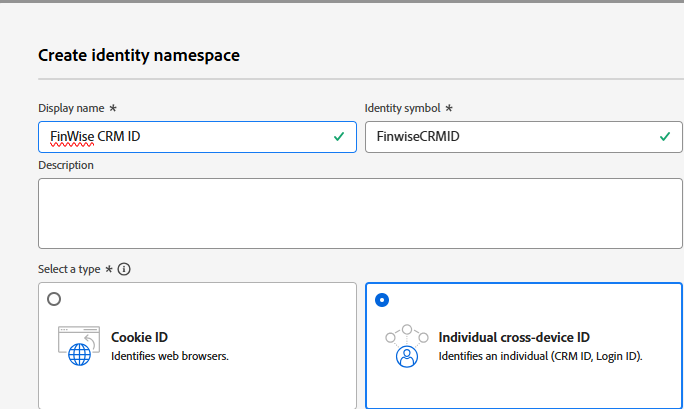
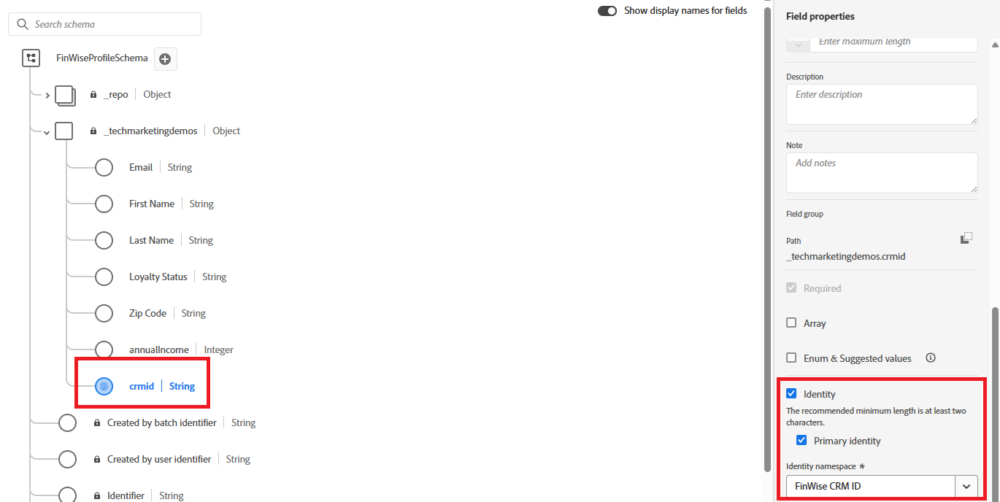
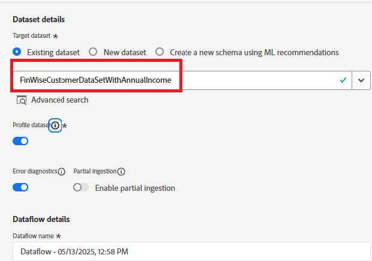
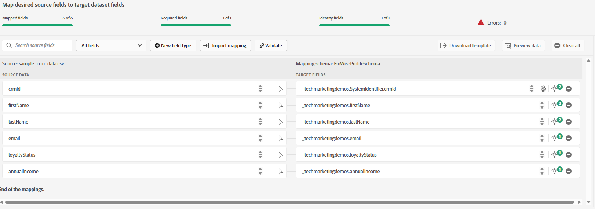
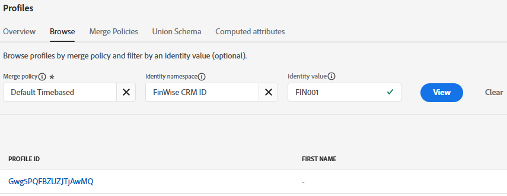

# Importar dados de amostra do CRM para o conjunto de dados de perfil do AEP

Para começar a compilação de identidade, importe dados de perfil de amostra do CRM para um conjunto de dados vinculado a um esquema habilitado para perfil no Adobe Experience Platform

## Criar um namespace personalizado

* Navegue até Cliente -> Identidades -> Criar namespace de identidade
* Selecione ID individual entre dispositivos e forneça o nome de exibição e o símbolo de identidade como mostrado na captura de tela abaixo.
  

## Criar um esquema ativado por perfil

Crie um esquema de perfil individual chamado **_FinWiseProfileSchema_**. Inclua campos, como annualIncome, email, firstName, lastName e fidelizeStatus.
Adicione um campo de identidade **_crmid_** conforme mostrado. Marque o campo crmid como identidade e primário.

## Preparar dados de amostra

Atualize os endereços de email fictícios para os reais. Eles serão usados posteriormente ao enviar mensagens com o Adobe Journey Optimizer.

|   | crmId | firstName | lastName | email | fidelizarStatus | zipCode | annualIncome |
|---|--------|-----------|----------|-------------------------|---------------|---------|--------------|
|   | FIN001 | Alice | Wong | alice.wong@example.com | Ouro | 92128 | 120000 |
|   | FIN002 | Bob | Smith | bob.smith@example.com | Prata | 92126 | 85000 |
|   | FIN003 | Charlie | Kim | charlie.kim@example.com | Platina | 60614 | 175000 |
|   | FIN004 | Diana | Lee | diana.lee@example.com | Ouro | 30303 | 98000 |
|   | FIN005 | Ethan | Marrom | ethan.brown@example.com | Bronze | 75201 | 60000 |

## Assimilar o arquivo CSV

* Crie um conjunto de dados chamado **_FinWiseCustomerDataSetWithAnnualIncome_** com base no **_FinWiseProfileSchema_** criado no anterior. Verifique se o conjunto de dados está habilitado para o perfil.

* Navegue até Conexões -> Fontes -> Sistema local
* Selecione o **_Adicionar dados_** em Carregamento de arquivo local. Selecione o _&#x200B;**FinWiseCustomerDataSetWithAnnualIncome**&#x200B;_ como o conjunto de dados de destino.
  
* Navegue até a próxima tela. Carregue o [arquivo csv](assets/finwise_profiles.csv) e verifique os mapeamentos
  

* Clique em Concluir para iniciar o processo de assimilação de dados

## Verificar perfil

* Navegue até Cliente ->Perfis e procure por ID de CRM do FinWise igual a FIN001 ou qualquer outro valor válido
  
