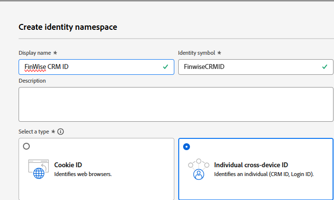

# Importar dados de amostra do CRM para o conjunto de dados de perfil do AEP

Para começar a compilação de identidade, importe dados de perfil de amostra do CRM para um conjunto de dados vinculado a um esquema habilitado para perfil no Adobe Experience Platform

## Criar um namespace personalizado

* Navegue até Cliente -> Identidades -> Criar namespace de identidade
* Selecione ID individual entre dispositivos e forneça o nome de exibição e o símbolo de identidade como mostrado na captura de tela abaixo.
  

## Criar um esquema ativado por perfil

Crie um esquema de perfil individual chamado **_FinWiseProfileSchema_**. Inclua campos, como annualIncome, email, firstName, lastName e fidelizeStatus.
Adicione um campo de identidade **_crmid_** sob o objeto SystemIdentifier. Marcar o campo cruzado como identidade e principal

## Preparar dados de amostra

| crmId | firstName | lastName | email | fidelizarStatus | annualIncome |
|--------|-----------|----------|---------------------------|---------------|--------------|
| FIN001 | Alice | Wong | alice.wong@example.com | Ouro | 336104 |
| FIN002 | Brian | Smith | brian.smith@example.com | Prata | 191065 |
| FIN003 | Cathy | Johnson | cathy.johnson@example.com | Bronze | 117015 |
| FIN004 | David | Lee | david.lee@example.com | Bronze | 61869 |
| FIN005 | Eva | Martinez | eva.martinez@example.com | Prata | 191371 |
| FIN006 | Frank | Marrom | frank.brown@example.com | Prata | 196132 |
| FIN007 | Grace | Kim | grace.kim@example.com | Ouro | 309851 |
| FIN008 | Henry | Davis | henry.davis@example.com | Ouro | 318378 |
| FIN009 | Isla | Clark | isla.clark@example.com | Prata | 181776 |
| FIN010 | Tomada | Lopez | jack.lopez@example.com | Prata | 186643 |

## Assimilar o arquivo CSV

* Crie um conjunto de dados chamado **_FinWiseCustomerDataSetWithAnnualIncome_** com base no **_FinWiseProfileSchema_** criado na etapa anterior

* Navegue até Conexões -> Fontes -> Sistema local
* Selecione o **_Adicionar dados_** em Carregamento de arquivo local. Selecione o _&#x200B;**FinWiseCustomerDataSetWithAnnualIncome**&#x200B;_ como o conjunto de dados de destino.
  
* Navegue até a próxima tela. Carregue o [arquivo csv](assets/sample_crm_data.csv) e verifique os mapeamentos
  

* Clique em Concluir para iniciar o processo de assimilação de dados

## Verificar perfil

* Navegue até Cliente ->Perfis e procure por ID de CRM do FinWise igual a FIN001 ou qualquer outro valor válido
  
