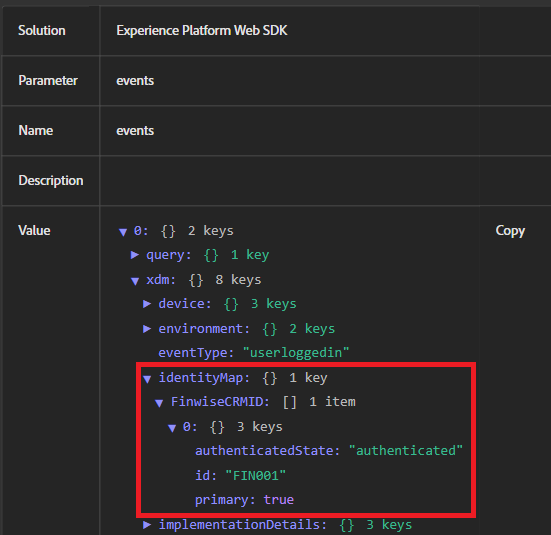

# Testar a compilação de identidade

Este aplicativo de amostra simula um fluxo de logon real no qual as credenciais do usuário são validadas no lado do servidor antes que a ID do CRM seja enviada para o Adobe Experience Platform (AEP). Um servidor Node.js local é usado para fornecer com segurança as páginas da Web, lidar com a lógica de autenticação básica e evitar restrições do navegador (como acesso de arquivo local bloqueado ou cabeçalhos CORS ausentes) que podem interferir na funcionalidade do Adobe Launch ou do Web SDK. Essa configuração garante que a experiência esteja mais próxima de um ambiente de produção real.

## Instalar node.js

Se você não tiver o Node.js instalado, baixe e [instale-o daqui](https://nodejs.org/)

Verifique a instalação executando:

`node -v`

`npm -v`

## Configurar a pasta do projeto

Crie um novo diretório para o aplicativo de amostra usando os seguintes comandos

`mkdir aep-demo`

`cd aep-demo`

## Inicializar o projeto

`npm init -y`

## Instalar o Express (Web Server Framework)

`npm install express`

## Criar arquivo server.js

```javascript
const express = require('express');
const path = require('path');
const app = express();
const PORT = 3000;

// Serve static files from the current directory
app.use(express.static(__dirname));

app.listen(PORT, () => {
  console.log(`Server is running at http://localhost:${PORT}`);
});
```

## Adicionar o HTML/Assets

Copie todos os [arquivos HTML e CSS](assets/login-app-files.zip) fornecidos nesta pasta. Copie e cole o script AEP Tags na seção `<head>` do arquivo index.html.

## Executar o servidor

`node server.js`

## Teste

Abra a url `http://localhost:3000`. O login está usando alice/pass123

## Usar o AEP Debugger

O Adobe Experience Platform Debugger é uma poderosa extensão de navegador que ajuda a validar os dados que estão sendo enviados do seu site para a Adobe Experience Platform. É especialmente útil para verificar se o identityMap está configurado e transmitido corretamente pelo Adobe Web SDK (alloy.js).

Use o AEP Debugger ao testar eventos de logon, verificar a identificação (por exemplo, ECID e CRMID sendo transmitidos) e garantir que as regras de tags da AEP e os elementos de dados sejam acionados conforme esperado. Ele fornece visibilidade em tempo real sobre eventos de saída, informações de identidade e cargas XDM — essenciais para a solução de problemas de enriquecimento de perfil e qualificação de público-alvo.

A captura de tela a seguir mostra a ID &quot;FIN001&quot; sendo transmitida corretamente.


## Etapas para verificar a configuração de identidade no AEP

* Fazer logon no AEP
* Navegue até Cliente -> Perfis ->Procurar
* Procure por FinWise CRM ID = FIN001
* Abra o perfil e verifique a seção Identidades. Você verá o CRMID e a ECID listados.   Isso confirma que as duas identidades foram compiladas em um único perfil.


