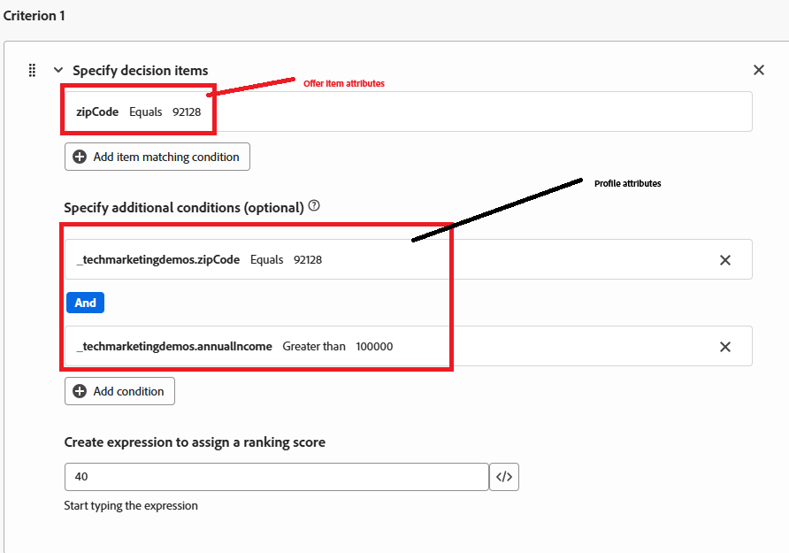

# Criar fórmula de classificação

Uma fórmula de classificação no Adobe Journey Optimizer é usada durante o Offer Decisioning, especificamente em uma estratégia de seleção para determinar a ordem de prioridade das ofertas elegíveis. A fórmula de classificação entra em ação após a filtragem de qualificação, quando várias ofertas se qualificam para um determinado perfil, mas somente a principal (ou algumas) deve ser apresentada com base na lógica de negócios ou no contexto do perfil.

* Fazer logon no Journey Optimizer

* Decisão ->Configuração da estratégia ->Fórmulas de classificação ->Criar fórmula

Fórmula de Classificação

Um critério em uma fórmula de classificação refere-se a uma regra condicional usada para atribuir uma pontuação a uma oferta. Esses critérios comparam atributos da oferta e o perfil ou contexto para determinar a relevância de uma oferta para um indivíduo específico.

Critério 1

O critério 1 contém três critérios:

* oferta._techmarketingdemos.offerDetails.zipCode == &quot;92128&quot; - verifica o CEP associado à oferta.

* _techmarketingdemos.zipCode == &quot;92128&quot; - verifica o código postal no perfil do usuário.

* _techmarketingdemos.annualIncome > 100000 - verifica o nível de renda do perfil do usuário.

Se todos esses critérios forem atendidos, a oferta obterá uma pontuação de 40.

Critério 2

O critério 2 contém três critérios:

* oferta._techmarketingdemos.offerDetails.zipCode == &quot;92126&quot; - verifica o CEP associado à oferta.

* _techmarketingdemos.zipCode == &quot;92126&quot; - verifica o código postal no perfil do usuário.

* _techmarketingdemos.annualIncome &lt; 100000 - verifica o nível de renda do perfil do usuário.

Se todos esses critérios forem atendidos, a oferta obterá uma pontuação de 30.

