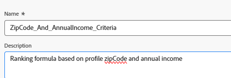

# Criar fórmula de classificação

Uma fórmula de classificação no Adobe Journey Optimizer é usada durante o Offer Decisioning, especificamente em uma estratégia de seleção para determinar a ordem de prioridade das ofertas elegíveis. A fórmula de classificação entra em ação após a filtragem de qualificação, quando várias ofertas se qualificam para um determinado perfil, mas somente a principal (ou algumas) deve ser apresentada com base na lógica de negócios ou no contexto do perfil.

* Fazer logon no Journey Optimizer

* Decisão ->Configuração da estratégia ->Fórmulas de classificação ->Criar fórmula

Fórmula de Classificação


Um critério em uma fórmula de classificação refere-se a uma regra condicional usada para atribuir uma pontuação a uma oferta. Esses critérios comparam atributos da oferta e o perfil ou contexto para determinar a relevância de uma oferta para um indivíduo específico.


Critério 1

Esta condição filtra os itens de decisão (ofertas) **para incluir apenas** as ofertas marcadas com &quot;IncomeLevel&quot;.
Essas ofertas filtradas prosseguirão para a próxima etapa (como classificação ou entrega) com base na lógica adicional definida.


A expressão a seguir é usada para criar a pontuação de classificação

```pql
if(   offer._techmarketingdemos.offerDetails.zipCode = _techmarketingdemos.zipCode,   _techmarketingdemos.annualIncome / 1000 + 10000,   if(     not offer._techmarketingdemos.offerDetails.zipCode,     _techmarketingdemos.annualIncome / 1000,     -9999   ) )
```

O que a Fórmula Faz

* Se a oferta tiver o mesmo CEP do usuário, atribua a ele uma pontuação muito alta para que seja escolhido primeiro.

* Se a oferta não tiver um CEP (é uma oferta geral), atribua a ela uma pontuação normal com base na renda do usuário.

* Se a oferta tiver um CEP diferente do usuário, atribua a ela uma pontuação muito baixa para que não seja selecionada.

Dessa forma, o sistema:

* Sempre tenta mostrar uma oferta correspondente a um ZIP primeiro,

* Retorna a uma oferta geral se nenhuma correspondência for encontrada e evita mostrar ofertas destinadas a outros códigos postais.


Se um item de oferta não atender a nenhum dos critérios de filtro (como não ter a tag &quot;IncomeLevel&quot; ), a oferta receberá uma pontuação de classificação padrão de 10.


