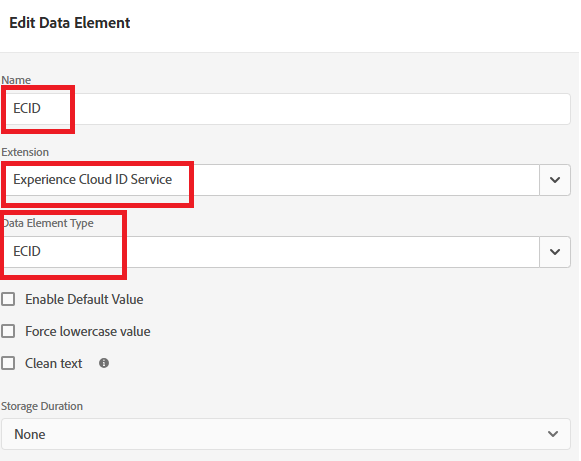

# Criar tags do Adobe Experience Platform

As tags do Experience Platform são configuradas na página da Web para carregar o Adobe Experience Platform Web SDK, permitindo que a chamada da API sendEvent acione experiências personalizadas. Essa configuração garante que as bibliotecas do lado do cliente necessárias sejam inicializadas corretamente, permitindo a interação em tempo real com a Adobe Journey Optimizer para a entrega de ofertas.

1. Faça logon em Coleção de dados.
1. Clique em **[!UICONTROL Marcas]** > **[!UICONTROL Nova Propriedade]**.
1. Crie uma tag Adobe Experience Platform chamada ECID Service.
1. Adicione as seguintes extensões à tag:

   

1. Configure o Adobe Experience Platform Web SDK para usar o ambiente correto e o DataStream dos consultores financeiros criados no tutorial anterior

   

Nenhuma configuração adicional é necessária para a Camada de dados de clientes Adobe e as extensões principais

## Criar o elemento de dados

O elemento de dados da ECID nas tags do Experience Platform é criado apenas para fins de depuração e teste. O elemento de dados permite aos desenvolvedores visualizar a Experience Cloud ID atribuída à sessão do navegador de um usuário, o que pode ajudar a validar a identificação e garantir que as chamadas do `sendEvent` sejam associadas ao perfil correto. Esse elemento não é necessário para que a personalização funcione, mas é útil durante a implementação e o QA




## Incluir tags do AEP na página do HTML

Crie e publique as Tags do Adobe Experience Platform.

Quando uma propriedade de Tags do AEP é publicada, o Adobe fornece uma tag de script que você deve colocar dentro da HTML ``` <head>``` ou na parte inferior das tags ``` <body>```.

1. Vá para a propriedade Tags (ECID Service).

1. Clique em Ambientes e, em seguida, clique no ícone de instalação do ambiente desejado (por exemplo, Desenvolvimento, Armazenamento temporário, Produção).

1. Observe o código incorporado.

   Esse código precisa ser colocado antes da marca de fechamento ```</body>``` na página do HTML.
