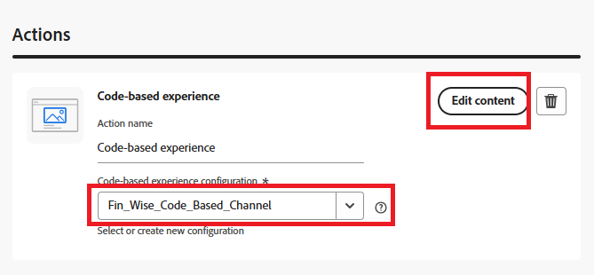

# Criar uma campanha

No Adobe Journey Optimizer (AJO), uma campanha serve como um contêiner que reúne todos os elementos necessários para fornecer experiências personalizadas a um público-alvo direcionado. Ele orquestra quando e como as ofertas são apresentadas, vinculando componentes como canais, disposições, coleções e estratégias de decisão.

1. Faça logon no Journey Optimizer.
1. Clique em **[!UICONTROL Gerenciamento de Jornadas]** > **[!UICONTROL Campanhas]** > **[!UICONTROL Criar campanha]** > **[!UICONTROL Agendar Marketing]**.
1. Forneça um nome significativo para a campanha
1. Navegue até a guia _**Ação**_
1. Selecione a ação **[!UICONTROL Experiência baseada em código]** e selecione a configuração criada na etapa anterior.
1. Clique em **[!UICONTROL Editar conteúdo]**.

   

1. Para abrir o editor de personalização, clique em **[!UICONTROL Editar código]**.

   

   O editor de personalização é uma interface de criação de experiência não visual que permite criar seu código.
